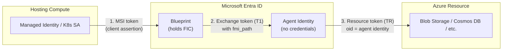

# Entra Agent ID with Azure Apps

This repository contains technical documentation and demo applications for **Microsoft Entra Agent ID** -- a purpose-built identity framework for autonomous AI agents.

## Authentication Pattern: Autonomous Agents

All demos in this repository implement the **autonomous agent** operation pattern, one of two authentication patterns supported by Entra Agent ID:

| Pattern | Description | Token subject | Use case |
|---|---|---|---|
| **Autonomous** (this repo) | Agent acts under its own identity, independent of any user session | Agent identity | Background jobs, scheduled tasks, API-to-API calls |
| **Interactive** | Agent acts on behalf of a signed-in user (delegated permissions) | User (agent is the actor) | Chat agents, user-facing copilots |

In the autonomous pattern, the agent authenticates as itself -- not as a user, not as the hosting application. The token's `sub` claim is the agent identity's service principal, so audit logs show exactly **which agent** accessed **which resource**. This solves the fundamental problem of shared managed identities where multiple agents on the same compute are indistinguishable in logs.

The key benefit: RBAC roles are assigned to the **agent identity** (not the blueprint, not the managed identity). Each agent gets its own discrete, auditable identity with scoped permissions.

---

## Documents

### [AKS Agent Identity Guide](./docs/flow-aks-agent-identity.md)

End-to-end guide for running Agent ID on AKS with the Entra SDK sidecar. Covers the seven-step walkthrough, sidecar pattern, FIC exchange flow, and governance controls.

### [AKS Demo Application](./demo-aks/README.md)

Working demo with persona-separated scripts (00-06). Python Flask app with sidecar writes to Azure Blob Storage. Includes governance demo: disable/re-enable agent access via FIC removal.

### [Functions Demo — Python](./demo-functions/README.md)

Azure Functions demo using two-step token exchange (MSI → T1 → TR). Self-contained with its own blueprint and prerequisites. Raw HTTP approach (Python SDKs lack `fmi_path` support). Throttled blob writes via agent identity.

### [Functions Demo — .NET](./demo-functions-dotnet/README.md)

Azure Functions demo (C# .NET 8) using SDK-native `FmiTransport` pattern. Self-contained with its own blueprint and prerequisites. Same pipeline as Python demo but uses `Azure.Identity` with custom transport — no raw HTTP needed.

### [Functions Agent Identity Guide](./docs/functions-agent-identity.md)

Technical reference for Agent ID on Functions/App Service: two-step token exchange, C# credential classes, SDK support matrix, and comparison with K8s.

### [Governance & Adoption Guide](./docs/agent-id-governance-ownership.md)

Enterprise governance reference: RACI matrix, required Entra roles, lifecycle flow, code snippets for both personas, access packages, conditional access, and adoption roadmap.

### [Concepts Reference](./docs/concepts.md)

Quick reference for core objects (blueprints, agent identities, FICs, sponsors, management app), required Entra roles with explanations of why each is needed, blocked permissions, and token exchange flows.

---

## Key Concepts

- **Blueprint** -- Entra app registration serving as the template for a class of agents. Holds the FIC and conditional access policies. Managed by the central platform team.
- **Agent Identity** -- Runtime service principal created from a blueprint. No credentials of its own. RBAC roles are assigned here.
- **FIC** -- Federated Identity Credential linking compute (MI or K8s SA) to the blueprint. Configured on the blueprint, not the agent identity.

See [Entra Agent ID docs](https://learn.microsoft.com/entra/agent-id/) for full details.

---

## Persona Summary

| Persona | Owns | Entra Roles Required |
|---|---|---|
| Central Platform Team | Blueprints, managed identities, FICs, access packages, conditional access, audit | Agent ID Administrator, Privileged Role Admin, Cloud App Admin, Identity Governance Admin, Conditional Access Admin |
| Agent Development Team | Agent identities (runtime), application code, token exchange, permission requests | None (interacts via blueprint tokens) |

---

## References

- [Entra Agent ID Documentation](https://learn.microsoft.com/entra/agent-id/)
- [Agent Identity on App Service and Azure Functions](https://learn.microsoft.com/azure/app-service/overview-agent-identity)
- [Create an Agent Identity Blueprint](https://learn.microsoft.com/entra/agent-id/identity-platform/create-blueprint)
- [Agent OAuth Protocols](https://learn.microsoft.com/entra/agent-id/identity-platform/agent-oauth-protocols)
- [Governing Agent Identities](https://learn.microsoft.com/entra/id-governance/agent-id-governance-overview)
- [Access Packages for Agents](https://learn.microsoft.com/entra/agent-id/identity-professional/agent-access-packages)

### Blog

- [Giving Your AI Agents a Real Identity](./docs/blog-agent-id-overview.md) -- Technical introduction to Entra Agent ID for architects and platform teams

### Supporting Source Material

- [deck.md](./docs/deck.md) -- Marp markdown slides covering K8s agent identity concepts
