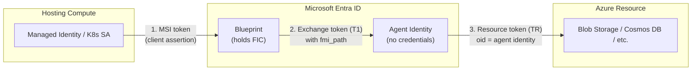

# Entra Agent ID with Azure Apps

This repository contains technical documentation and demo applications for **Microsoft Entra Agent ID** -- a purpose-built identity framework for autonomous AI agents.

## Authentication Pattern: Autonomous Agents

All demos in this repository implement the **autonomous agent** operation pattern, one of two authentication patterns supported by Entra Agent ID:

| Pattern | Description | Token subject | Use case |
|---|---|---|---|
| **Autonomous** (this repo) | Agent acts under its own identity, independent of any user session | Agent identity | Background jobs, scheduled tasks, API-to-API calls |
| **Interactive** | Agent acts on behalf of a signed-in user (delegated permissions) | User (agent is the actor) | Chat agents, user-facing copilots |

In the autonomous pattern, the agent authenticates as itself -- not as a user, not as the hosting application. The token's `sub` claim is the agent identity's service principal, so audit logs show exactly **which agent** accessed **which resource**. This solves the fundamental problem of shared managed identities where multiple agents on the same compute are indistinguishable in logs.

The key benefit: RBAC roles are assigned to the **agent identity** (not the blueprint, not the managed identity). Each agent gets its own discrete, auditable identity with scoped permissions.

---

## Documents

### [AKS Agent Identity Guide](./docs/flow-aks-agent-identity.md)

End-to-end guide for running Agent ID on AKS with the Entra SDK sidecar. Covers:

- Seven-step walkthrough from blueprint creation to resource access
- Microsoft Entra SDK for AgentID sidecar pattern (zero auth code in your app)
- FIC exchange flow: K8s JWT → exchange token → resource token
- Interaction diagram and runtime call flow
- Organizational responsibilities (governance vs dev team)
- Governance controls: FIC removal as kill switch, token TTL, audit
- Side-by-side comparison: AKS vs Functions

### [AKS Demo Application](./demo-aks/README.md)

Working end-to-end demo with persona-separated scripts. Includes:

- Automated scripts (00-06) covering prerequisites, AKS provisioning, blueprint creation, agent identity, storage RBAC, deployment, and verification
- Python Flask app with sidecar -- zero auth code, writes to Azure Blob Storage every 60s
- Governance demo: disable agent access by removing the FIC, verify failure, re-enable

### [Functions Demo Application](./demo-functions/README.md)

Azure Functions demo (Python) using two-step token exchange (MSI → T1 → TR). Includes:

- Automated scripts (01-06) reusing the same blueprint from the AKS demo
- Python Function App with raw HTTP token exchange (Python SDKs lack `fmi_path` support)
- Throttled blob writes via agent identity (60s success / 5s failure cooldown)
- SDK support matrix explaining why raw HTTP is required for Python

### [Functions Demo Application — .NET](./demo-functions-dotnet/README.md)

Azure Functions demo (C# .NET 8) using the **SDK-native `FmiTransport` pattern**. Includes:

- Same 6-step pipeline as the Python demo (shared infrastructure scripts)
- .NET implementation using `Azure.Identity` with custom `FmiTransport` (no raw HTTP needed)
- Three credential classes: `AgentIdentityBlueprintCredential`, `FmiTransport`, `AgentIdentityCredential`
- Side-by-side comparison with the Python approach

### [Functions Agent Identity Guide](./docs/functions-agent-identity.md)

Detailed technical reference for running Agent ID on Azure Functions and App Service. Covers:

- How Functions differs from Kubernetes (managed identity vs projected SA tokens)
- Architecture and setup (user-assigned MI, FIC configuration)
- Two-step token exchange mechanics
- C# credential classes (AgentBlueprintCredential, AgentIdentityCredential, FmiTransport)
- Autonomous vs interactive agent patterns
- SDK options (in-code Azure.Identity vs containerized Agent ID SDK)
- Side-by-side comparison table: K8s vs Functions

### [Governance, Ownership, and Adoption Guide](./docs/agent-id-governance-ownership.md)

Comprehensive governance reference for enterprise adoption. Covers:

- **Persona definitions** -- Central Platform Team and Agent Development Team with clear ownership boundaries
- **Responsibility matrix** -- RACI for every activity from tenant enablement to decommissioning
- **Required Entra roles** -- Per-persona role assignments (Agent ID Administrator, Privileged Role Admin, etc.)
- **Lifecycle flow** -- End-to-end from blueprint creation through ongoing governance, with handoff points
- **Code snippets** -- Graph API, PowerShell, C#, and Python examples for both personas
- **Governance mechanisms** -- Conditional access, access packages, blocked roles/permissions, audit
- **Adoption roadmap** -- Four phases from prerequisites to production operations
- **Decision framework** -- Who creates blueprints (central team only), who creates identities (dev team at runtime)
- **Security guardrails** -- Blocked high-privilege roles, time-bound access, sponsor requirements

---

## Key Concepts

**Agent Identity Blueprint** -- An Entra application registration that serves as the template for a class of agents. Holds the federated identity credential (FIC), defines scopes and conditional access. Created and managed exclusively by the central platform team.

**Agent Identity** -- A runtime service principal created from a blueprint. Has no credentials of its own. The blueprint impersonates it to obtain resource tokens. Created by the dev team at runtime via the blueprint token.

**Federated Identity Credential (FIC)** -- The trust link between compute infrastructure and the blueprint. Configured on the blueprint application object, not on the agent identity (agent identities have no credentials of their own). On Functions: links a managed identity principal ID. On K8s: links the OIDC issuer URL and service account subject. See [Blueprint concepts](https://learn.microsoft.com/entra/agent-id/identity-platform/agent-blueprint) and [Agent identities](https://learn.microsoft.com/entra/agent-id/identity-platform/agent-identities).

---

## Persona Summary

| Persona | Owns | Entra Roles Required |
|---|---|---|
| Central Platform Team | Blueprints, managed identities, FICs, access packages, conditional access, audit | Agent ID Administrator, Privileged Role Admin, Cloud App Admin, Identity Governance Admin, Conditional Access Admin |
| Agent Development Team | Agent identities (runtime), application code, token exchange, permission requests | None (interacts via blueprint tokens) |

---

## References

- [Entra Agent ID Documentation](https://learn.microsoft.com/entra/agent-id/)
- [Agent Identity on App Service and Azure Functions](https://learn.microsoft.com/azure/app-service/overview-agent-identity)
- [Create an Agent Identity Blueprint](https://learn.microsoft.com/entra/agent-id/identity-platform/create-blueprint)
- [Agent OAuth Protocols](https://learn.microsoft.com/entra/agent-id/identity-platform/agent-oauth-protocols)
- [Governing Agent Identities](https://learn.microsoft.com/entra/id-governance/agent-id-governance-overview)
- [Access Packages for Agents](https://learn.microsoft.com/entra/agent-id/identity-professional/agent-access-packages)

### Blog

- [Giving Your AI Agents a Real Identity](./docs/blog-agent-id-overview.md) -- Technical introduction to Entra Agent ID for architects and platform teams

### Supporting Source Material

- [deck.md](./docs/deck.md) -- Marp markdown slides covering K8s agent identity concepts
