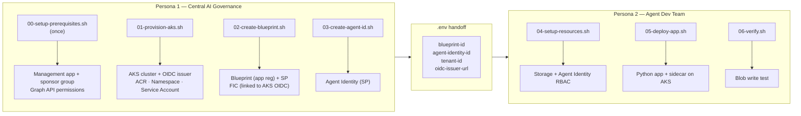
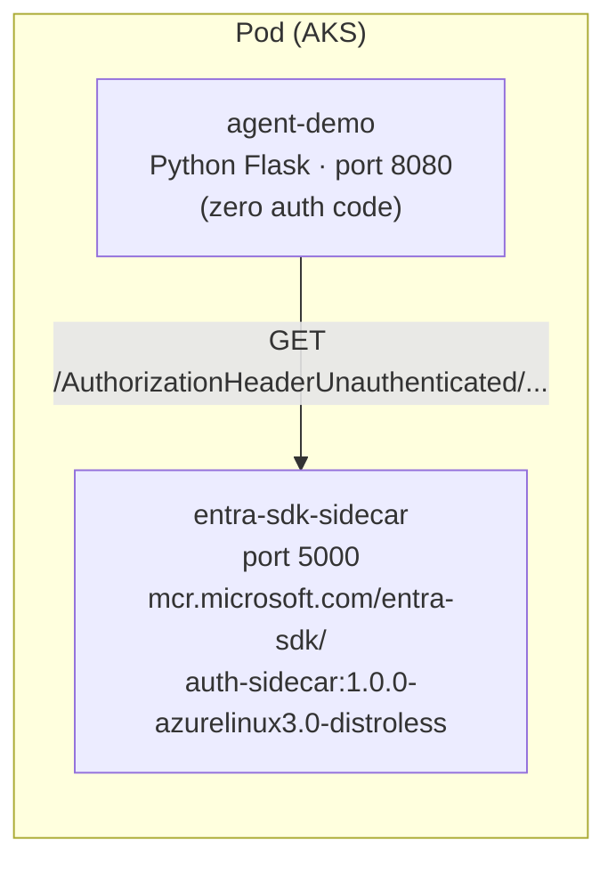

# Agent ID Demo — Workload Identity Federation on AKS

This demo showcases Microsoft Entra Agent ID with clear persona separation between a Central AI Governance Team and an Agent Development Team. It implements the **[autonomous agent](https://www.willvelida.com/posts/entra-agent-id-how-to-auth-to-azure/#two-operation-patterns)** operation pattern -- the agent authenticates under its own identity via the Entra SDK sidecar, and the resulting token's `sub`/`oid` claims identify the agent, not the hosting application.

## Architecture



## Prerequisites

- Azure CLI 2.x with the isolated test tenant session:
  ```bash
  source ./az-agentid-setup.sh
  ```
- `kubectl`, `docker`, and `jq` installed
- The test tenant must be onboarded to the Entra Agent ID preview
- Current user needs Global Admin or Privileged Role Admin (for `00-setup-prerequisites.sh`)

## Setup

The `.env` file is progressively built by each script. No manual editing needed -- just run the scripts in order.

### Before You Begin

Set custom names for your resource group and cluster. Edit these defaults in `01-provision-aks.sh` or export them before running:

```bash
export RESOURCE_GROUP=rg-myproject-agentid
export CLUSTER_NAME=aks-myproject-agentid
```

If you skip this, the defaults (`rg-agentid-demo` / `aks-agentid-demo`) are used.

### How `.env` works

| Script | Writes to `.env` |
|---|---|
| `00-setup-prerequisites.sh` | MGMT_APP_ID, MGMT_APP_SECRET, SPONSOR_GROUP_ID |
| `01-provision-aks.sh` | AKS config, ACR_NAME (preserves existing values) |
| `02-create-blueprint.sh` | Blueprint IDs, tenant ID |
| `03-create-agent-id.sh` | Agent identity IDs |
| `04-setup-resources.sh` | Storage account name |
| `05-deploy-app.sh` | (read-only) |
| `06-verify.sh` | (read-only) |

## Execution Order

### Persona 1 — Central AI Governance Team

```bash
cd demo

# 0. One-time: create management app + sponsor group (writes MGMT_APP_* to .env)
bash persona-1-governance/00-setup-prerequisites.sh

# 1. Provision AKS cluster + ACR (writes OIDC_ISSUER_URL, ACR_NAME to .env)
bash persona-1-governance/01-provision-aks.sh

# 2. Create blueprint + FIC (reads OIDC_ISSUER_URL from .env)
bash persona-1-governance/02-create-blueprint.sh

# 3. Create agent identity (reads blueprint config from .env)
bash persona-1-governance/03-create-agent-id.sh

# Hand off .env to Persona 2
```

### Persona 2 — Agent Development Team

```bash
cd demo

# 4. Create storage account and assign RBAC to agent identity
bash persona-2-developer/04-setup-resources.sh

# 5. Build and deploy demo app with sidecar
bash persona-2-developer/05-deploy-app.sh

# 6. Verify blob writes
bash persona-2-developer/06-verify.sh
```

## What the Demo App Does

The Python Flask app uses the **Microsoft Entra SDK for AgentID** sidecar container for all token management. Zero auth code in the app itself.

### Endpoints

- **`GET /`** -- App info and available endpoints
- **`GET /write-status`** -- Returns cached blob write result. A background thread writes a heartbeat blob every 60s using an agent identity-scoped token. Returns `success-write` or `fail-write`
- **`GET /sidecar-health`** -- Checks if the Entra SDK sidecar container is responsive
- **`GET /health`** -- Liveness probe

### Architecture



A successful `/write-status` response shows:
- `last_result: "success-write"` -- blob heartbeats written every 60s
- `total_success` / `total_fail` -- running counters

## Disabling Agent Access (Governance Demo)

The key governance demo is showing that the central team can instantly disable agent access by removing the FIC from the blueprint. See **[docs/demo-disable-verify.md](../docs/demo-disable-verify.md)** for step-by-step instructions covering:

1. Verify current working state
2. Delete the FIC on the blueprint
3. Verify `/write-status` switches to `fail-write`
4. Re-create the FIC and verify recovery

## Repeating for New Blueprints or Agent IDs

The scripts are designed to be repeatable:

- **New blueprint:** Change `BLUEPRINT_NAME` in `.env` and re-run `02-create-blueprint.sh`
- **New agent identity:** Change `AGENT_DISPLAY_NAME` in `.env` and re-run `03-create-agent-id.sh`
- **New AKS cluster:** Change `CLUSTER_NAME` and `RESOURCE_GROUP` and re-run `01-provision-aks.sh`

## Cleanup

```bash
source demo/.env

# Delete AKS resources and storage
az group delete --name $RESOURCE_GROUP --yes --no-wait

# Delete blueprint (via management app token)
TOKEN=$(curl -s -X POST "https://login.microsoftonline.com/${TENANT_ID}/oauth2/v2.0/token" \
  --data-urlencode "client_id=${MGMT_APP_ID}" \
  --data-urlencode "client_secret=${MGMT_APP_SECRET}" \
  --data-urlencode "scope=https://graph.microsoft.com/.default" \
  --data-urlencode "grant_type=client_credentials" | python3 -c "import sys,json; print(json.load(sys.stdin)['access_token'])")

curl -X DELETE "https://graph.microsoft.com/beta/applications/${BLUEPRINT_OBJECT_ID}" \
  -H "Authorization: Bearer ${TOKEN}"
```
