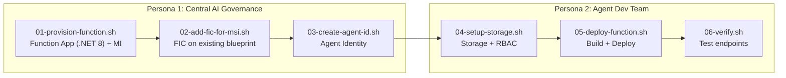
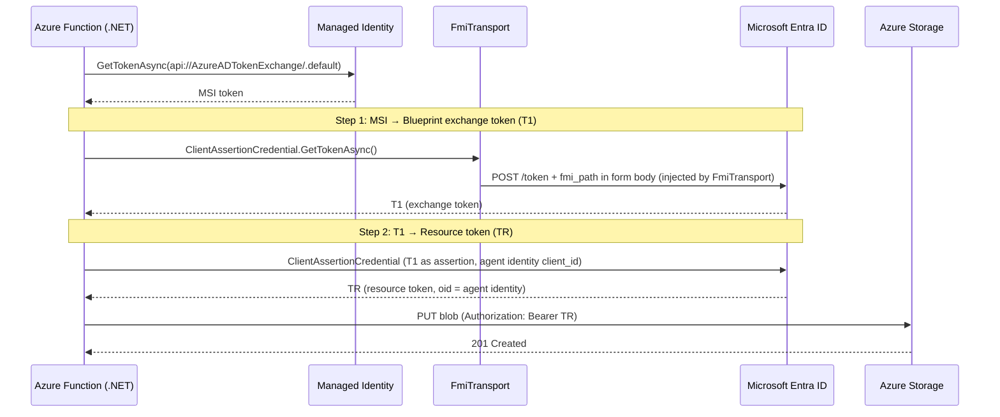

# Agent ID Demo — .NET Azure Functions with SDK-Native fmi_path

This demo showcases Microsoft Entra Agent ID on Azure Functions using **.NET 8** and the **SDK-native `FmiTransport` pattern** for the two-step token exchange. It implements the **[autonomous agent](https://www.willvelida.com/posts/entra-agent-id-how-to-auth-to-azure/#two-operation-patterns)** operation pattern -- the agent authenticates under its own identity (not a user's), and the resulting token's `sub`/`oid` claims identify the agent, not the hosting application. It is the C# counterpart of the [Python Functions demo](../demo-functions/README.md).

## Key Difference: SDK-Native vs Raw HTTP

The Python demo uses raw `requests.post()` because Python SDKs don't support `fmi_path`. This .NET demo uses **Azure.Identity's `ClientAssertionCredential`** with a custom `FmiTransport` that injects `fmi_path` as a query parameter -- the approach documented by Microsoft:

```mermaid
flowchart TD
    subgraph python["Python Demo (raw HTTP)"]
        P1["ManagedIdentityCredential.get_token()"]
        P2["requests.post(TOKEN_URL, data={...fmi_path...})"]
        P3["requests.post(TOKEN_URL, data={...assertion=T1...})"]
        P1 -->|MSI token| P2
        P2 -->|T1| P3
        P3 -->|Resource token| P4["BlobServiceClient"]
    end

    subgraph dotnet[".NET Demo (SDK-native FmiTransport)"]
        D1["ManagedIdentityCredential"]
        D2["ClientAssertionCredential + FmiTransport"]
        D3["ClientAssertionCredential"]
        D1 -->|MSI assertion| D2
        D2 -->|T1 with fmi_path| D3
        D3 -->|Resource token| D4["BlobServiceClient"]
    end
```



## Architecture



## Prerequisites

- Azure CLI 2.x with the isolated test tenant session:
  ```bash
  source ./az-agentid-setup.sh
  ```
- [.NET 8 SDK](https://dotnet.microsoft.com/download/dotnet/8.0)
- [Azure Functions Core Tools](https://learn.microsoft.com/azure/azure-functions/functions-run-local) v4+ (`func`)
- `jq` and `python3` installed
- **AKS demo prerequisites already completed** -- specifically:
  - `00-setup-prerequisites.sh` (management app + sponsor group)
  - `02-create-blueprint.sh` (blueprint already exists)

## Before You Begin

Copy required values from the AKS demo's `.env` into this demo's `.env`:

```bash
cp .env.template .env

# Copy these from ../demo/.env:
#   MGMT_APP_ID, MGMT_APP_SECRET, SPONSOR_GROUP_ID
#   TENANT_ID, BLUEPRINT_OBJECT_ID, BLUEPRINT_APP_ID
```

## How `.env` works

| Script | Writes to `.env` |
|---|---|
| `01-provision-function.sh` | Function App config, MI_CLIENT_ID, MI_PRINCIPAL_ID |
| `02-add-fic-for-msi.sh` | (read-only -- FIC created on existing blueprint) |
| `03-create-agent-id.sh` | Agent identity IDs (Persona 1) |
| `04-setup-storage.sh` | Storage account name |
| `05-deploy-function.sh` | (read-only) |
| `06-verify.sh` | (read-only) |

## Execution Order

### Persona 1 — Central AI Governance Team

```bash
cd demo-functions-dotnet

# 1. Create Function App (.NET 8) + User-Assigned Managed Identity
bash persona-1-governance/01-provision-function.sh

# 2. Add FIC for managed identity to existing blueprint
bash persona-1-governance/02-add-fic-for-msi.sh

# 3. Create agent identity from blueprint
bash persona-1-governance/03-create-agent-id.sh

# Hand off .env to Persona 2
```

### Persona 2 — Agent Development Team

```bash
cd demo-functions-dotnet

# 4. Create storage account and assign RBAC to agent identity
bash persona-2-developer/04-setup-storage.sh

# 5. Build and deploy .NET function code + configure app settings
bash persona-2-developer/05-deploy-function.sh

# 6. Verify endpoints
bash persona-2-developer/06-verify.sh
```

## Two-Step Token Exchange (SDK-Native)

Unlike the Python demo which requires raw HTTP POST, the .NET demo uses **Azure.Identity** with a custom `FmiTransport` class that injects `fmi_path` into the HTTP request:



### The FmiTransport Pattern

The key innovation is the `FmiTransport` class -- a custom `HttpClientTransport` that injects `fmi_path` into token endpoint requests. The [Microsoft docs](https://learn.microsoft.com/en-us/azure/app-service/overview-agent-identity?tabs=autonomous-agents#obtain-tokens-with-the-identity) show `AppendQuery`, but **the Entra token endpoint requires `fmi_path` in the POST body** (form-urlencoded), not as a URL query parameter. Using query params causes AADSTS82008.

Our implementation intercepts POST requests to `oauth2/v2.0/token` and appends `fmi_path` to the form body:

```csharp
public class FmiTransport(string agentIdentityId) : HttpClientTransport()
{
    public override ValueTask ProcessAsync(HttpMessage message)
    {
        InjectFmiPath(message);
        return base.ProcessAsync(message);
    }

    private void InjectFmiPath(HttpMessage message)
    {
        if (message.Request.Method != RequestMethod.Post) return;
        var uri = message.Request.Uri.ToString();
        if (!uri.Contains("oauth2/v2.0/token")) return;

        // Read existing form body and append fmi_path
        using var ms = new MemoryStream();
        message.Request.Content.WriteTo(ms, default);
        var body = Encoding.UTF8.GetString(ms.ToArray());
        body += "&fmi_path=" + Uri.EscapeDataString(agentIdentityId);
        message.Request.Content = RequestContent.Create(Encoding.UTF8.GetBytes(body));
    }
}
```

This transport is passed to `ClientAssertionCredentialOptions.Transport` when creating the blueprint credential:

```csharp
var blueprintCredential = new AgentIdentityBlueprintCredential(
    tenantId, blueprintId, miClientId,
    new ClientAssertionCredentialOptions
    {
        Transport = new FmiTransport(agentIdentityId) // ← injects fmi_path
    });
```

### Three Credential Classes

| Class | Role | Input | Output |
|---|---|---|---|
| `AgentIdentityBlueprintCredential` | MSI → blueprint token | MSI token as assertion | Blueprint exchange token |
| `FmiTransport` | Injects `fmi_path` into POST body | HTTP request | Modified HTTP request |
| `AgentIdentityCredential` | Full two-step exchange | Config values | Resource token (oid = agent identity) |

### SDK Support Comparison

| SDK | Language | `fmi_path` support | Approach used |
|---|---|---|---|
| **Azure.Identity (.NET)** | C# | ✅ via `FmiTransport` | Custom `HttpClientTransport` |
| **MSAL.NET** | C# | ✅ `WithFmiPath()` | First-class API |
| **Microsoft.Identity.Web** | C# | ✅ `FmiPath` on `TokenAcquisitionOptions` | Had [bug #3336](https://github.com/AzureAD/microsoft-identity-web/issues/3336), fixed |
| **MSAL Python** | Python | ❌ | Not supported |
| **azure-identity (Python)** | Python | ❌ | Not supported -- uses raw HTTP |

## What the Function App Does

A .NET Azure Function with zero secrets -- all authentication handled via managed identity + SDK-native two-step token exchange.

### Endpoints

- **`GET /api/write-status`** -- Performs a live blob write via the two-step token exchange and returns the result (`success-write` / `fail-write`)
- **`GET /api/health`** -- Liveness probe

### Throttling

- **Success**: 60s cooldown before next write
- **Failure**: 5s cooldown before retry
- Returns cached result with `throttled: true` and `next_write_in` seconds within the cooldown window

## Python vs .NET Comparison

| Aspect | Python Demo | .NET Demo |
|---|---|---|
| Runtime | Python 3.11 | .NET 8 (isolated worker) |
| `fmi_path` approach | Raw `requests.post()` | SDK-native `FmiTransport` |
| Token exchange code | ~30 lines (manual HTTP) | ~15 lines (SDK wiring) |
| Dependencies | azure-identity, requests | Azure.Identity (built-in) |
| Build step | None (Python) | `dotnet publish` |
| Auth code in app | Manual HTTP + credential class | Credential class composition |
| Debugging | See exact HTTP requests | SDK handles retry, logging |

## Cleanup

```bash
source demo-functions-dotnet/.env

# Delete Function App resources
az group delete --name $FUNC_RESOURCE_GROUP --yes --no-wait

# Remove the MSI FIC from the blueprint (keeps AKS FIC intact)
# Use the Graph API to list and delete the specific FIC named "msi-workload-identity"
```
