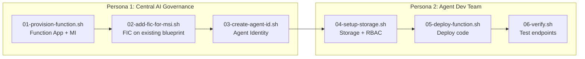

# Agent ID Demo — Azure Functions with Two-Step Token Exchange

This demo deploys an autonomous AI agent on Azure Functions using a managed identity and the two-step token exchange pattern, reusing the same blueprint from the AKS demo.

## Architecture



## Prerequisites

- Azure CLI 2.x with the isolated test tenant session:
  ```bash
  source ./az-agentid-setup.sh
  ```
- [Azure Functions Core Tools](https://learn.microsoft.com/azure/azure-functions/functions-run-local) v4+ (`func`)
- `jq` and `python3` installed
- **AKS demo prerequisites already completed** -- specifically:
  - `00-setup-prerequisites.sh` (management app + sponsor group)
  - `02-create-blueprint.sh` (blueprint already exists)

## Before You Begin

Copy required values from the AKS demo's `.env` into this demo's `.env`:

```bash
cp .env.template .env

# Copy these from ../demo/.env:
#   MGMT_APP_ID, MGMT_APP_SECRET, SPONSOR_GROUP_ID
#   TENANT_ID, BLUEPRINT_OBJECT_ID, BLUEPRINT_APP_ID
```

Optionally set custom names:
```bash
export FUNC_RESOURCE_GROUP=rg-myproject-func
export FUNC_APP_NAME=func-myproject-agentid
```

## How `.env` works

| Script | Writes to `.env` |
|---|---|
| `01-provision-function.sh` | Function App config, MI_CLIENT_ID, MI_PRINCIPAL_ID |
| `02-add-fic-for-msi.sh` | (read-only -- FIC created on existing blueprint) |
| `03-create-agent-id.sh` | AGENT_IDENTITY_ID, AGENT_IDENTITY_APP_ID |
| `04-setup-storage.sh` | Storage account name |
| `05-deploy-function.sh` | (read-only) |
| `06-verify.sh` | (read-only) |

## Execution Order

### Persona 1 — Central AI Governance Team

```bash
cd demo-functions

# 1. Create Function App + User-Assigned Managed Identity
bash persona-1-governance/01-provision-function.sh

# 2. Add FIC for managed identity to existing blueprint
bash persona-1-governance/02-add-fic-for-msi.sh

# 3. Create agent identity from blueprint
bash persona-1-governance/03-create-agent-id.sh

# Hand off .env to Persona 2
```

### Persona 2 — Agent Development Team

```bash
cd demo-functions

# 4. Create storage account and assign RBAC to agent identity
bash persona-2-developer/04-setup-storage.sh

# 5. Deploy function code + configure app settings
bash persona-2-developer/05-deploy-function.sh

# 6. Verify endpoints
bash persona-2-developer/06-verify.sh
```

## Token Exchange

This demo uses the two-step MSI → Blueprint → Resource token exchange. See [docs/functions-agent-identity.md](../docs/functions-agent-identity.md) for the detailed flow and implementation.

Python SDKs don't support `fmi_path` yet, so this demo uses raw HTTP. See [docs/functions-agent-identity.md](../docs/functions-agent-identity.md#sdk-support-for-fmi_path) for the full SDK comparison.

## What the Function App Does

A Python Azure Function with zero secrets -- all authentication handled via managed identity + two-step token exchange.

### Endpoints

- **`GET /api/write-status`** -- Performs a live blob write via the two-step token exchange and returns the result (`success-write` / `fail-write`)
- **`GET /api/health`** -- Liveness probe

## Cleanup

```bash
source demo-functions/.env

# Delete Function App resources
az group delete --name $FUNC_RESOURCE_GROUP --yes --no-wait

# Remove the MSI FIC from the blueprint (keeps AKS FIC intact)
# Use the Graph API to list and delete the specific FIC named "msi-workload-identity"
```
