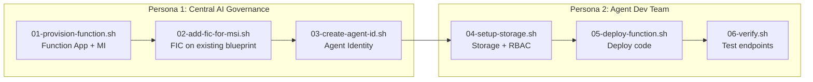
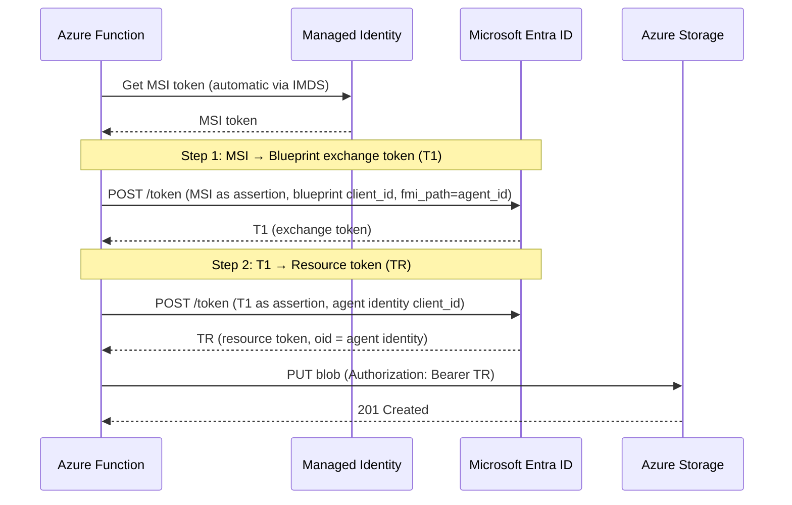

# Agent ID Demo — Azure Functions with Two-Step Token Exchange

This demo showcases Microsoft Entra Agent ID on Azure Functions using a **user-assigned managed identity** and the **two-step token exchange** pattern. It implements the **[autonomous agent](https://www.willvelida.com/posts/entra-agent-id-how-to-auth-to-azure/#two-operation-patterns)** operation pattern -- the agent authenticates under its own identity (not a user's), and the resulting token's `sub`/`oid` claims identify the agent, not the hosting application. It reuses the same blueprint from the AKS demo.

## Architecture



## Prerequisites

- Azure CLI 2.x with the isolated test tenant session:
  ```bash
  source ./az-agentid-setup.sh
  ```
- [Azure Functions Core Tools](https://learn.microsoft.com/azure/azure-functions/functions-run-local) v4+ (`func`)
- `jq` and `python3` installed
- **AKS demo prerequisites already completed** -- specifically:
  - `00-setup-prerequisites.sh` (management app + sponsor group)
  - `02-create-blueprint.sh` (blueprint already exists)

## Before You Begin

Copy required values from the AKS demo's `.env` into this demo's `.env`:

```bash
cp .env.template .env

# Copy these from ../demo/.env:
#   MGMT_APP_ID, MGMT_APP_SECRET, SPONSOR_GROUP_ID
#   TENANT_ID, BLUEPRINT_OBJECT_ID, BLUEPRINT_APP_ID
```

Optionally set custom names:
```bash
export FUNC_RESOURCE_GROUP=rg-myproject-func
export FUNC_APP_NAME=func-myproject-agentid
```

## How `.env` works

| Script | Writes to `.env` |
|---|---|
| `01-provision-function.sh` | Function App config, MI_CLIENT_ID, MI_PRINCIPAL_ID |
| `02-add-fic-for-msi.sh` | (read-only -- FIC created on existing blueprint) |
| `03-create-agent-id.sh` | AGENT_IDENTITY_ID, AGENT_IDENTITY_APP_ID |
| `04-setup-storage.sh` | Storage account name |
| `05-deploy-function.sh` | (read-only) |
| `06-verify.sh` | (read-only) |

## Execution Order

### Persona 1 — Central AI Governance Team

```bash
cd demo-functions

# 1. Create Function App + User-Assigned Managed Identity
bash persona-1-governance/01-provision-function.sh

# 2. Add FIC for managed identity to existing blueprint
bash persona-1-governance/02-add-fic-for-msi.sh

# 3. Create agent identity from blueprint
bash persona-1-governance/03-create-agent-id.sh

# Hand off .env to Persona 2
```

### Persona 2 — Agent Development Team

```bash
cd demo-functions

# 4. Create storage account and assign RBAC to agent identity
bash persona-2-developer/04-setup-storage.sh

# 5. Deploy function code + configure app settings
bash persona-2-developer/05-deploy-function.sh

# 6. Verify endpoints
bash persona-2-developer/06-verify.sh
```

## Two-Step Token Exchange

Unlike AKS (which uses an external OIDC issuer for a single-step exchange), Functions uses **Entra-to-Entra federation** requiring two steps:



### Python Implementation

```python
import requests
from azure.identity import ManagedIdentityCredential
from azure.core.credentials import AccessToken, TokenCredential

TOKEN_URL = f"https://login.microsoftonline.com/{TENANT_ID}/oauth2/v2.0/token"

class AgentIdentityCredential(TokenCredential):
    def __init__(self):
        self._msi = ManagedIdentityCredential(client_id=MI_CLIENT_ID)

    def _exchange(self, assertion, client_id, scope, fmi_path=None):
        data = {
            "client_id": client_id,
            "scope": scope,
            "client_assertion_type": "urn:ietf:params:oauth:client-assertion-type:jwt-bearer",
            "client_assertion": assertion,
            "grant_type": "client_credentials",
        }
        if fmi_path:
            data["fmi_path"] = fmi_path
        resp = requests.post(TOKEN_URL, data=data)
        resp.raise_for_status()
        return resp.json()["access_token"]

    def get_token(self, *scopes, **kwargs):
        scope = scopes[0]
        # Step 1: MSI → T1 (requires fmi_path!)
        msi_token = self._msi.get_token("api://AzureADTokenExchange/.default")
        t1 = self._exchange(msi_token.token, BLUEPRINT_CLIENT_ID,
                            "api://AzureADTokenExchange/.default",
                            fmi_path=AGENT_IDENTITY_ID)
        # Step 2: T1 → resource token
        tr = self._exchange(t1, AGENT_IDENTITY_ID, scope)
        return AccessToken(tr, ...)

# Use as a standard Azure SDK credential
blob_client = BlobServiceClient(account_url, credential=AgentIdentityCredential())
```

### Why Raw HTTP Instead of SDK?

The implementation uses raw `requests.post()` for the token exchange rather than Azure SDK classes like `ClientAssertionCredential`. This is deliberate -- the `fmi_path` parameter is **mandatory** for Agent ID token exchange (Entra returns `AADSTS82008` without it), and Python SDKs do not support it yet.

#### SDK Support for `fmi_path`

| SDK | Language | `fmi_path` support | Notes |
|---|---|---|---|
| **MSAL.NET** | C# | ✅ [`WithFmiPath()`](https://github.com/AzureAD/microsoft-authentication-library-for-dotnet) | First-class API on `AcquireTokenForClientParameterBuilder` |
| **Microsoft.Identity.Web** | C# | ✅ `FmiPath` on `TokenAcquisitionOptions` | Had [bug #3336](https://github.com/AzureAD/microsoft-identity-web/issues/3336) -- now fixed |
| **MSAL Python** | Python | ❌ Not supported | 0 references in source; `acquire_token_for_client()` has no extra-params mechanism |
| **azure-identity (Python)** | Python | ❌ Not supported | `ClientAssertionCredential` has no extension point for custom body parameters |

#### What `fmi_path` does

The `fmi_path` parameter tells Entra **which child agent identity** to impersonate during the token exchange. It is included as a form field in the Step 1 POST request:

```
POST /oauth2/v2.0/token
client_id=<BLUEPRINT_CLIENT_ID>
scope=api://AzureADTokenExchange/.default
client_assertion=<MSI_TOKEN>
grant_type=client_credentials
fmi_path=<AGENT_IDENTITY_ID>          ← required, no SDK support in Python
```

Without `fmi_path`, Entra returns:
> `AADSTS82008: All agentic applications requesting a token exchange token must include the fmipath parameter`

#### If you are building in C#

Use MSAL.NET for a cleaner SDK-native approach:

```csharp
var result = await app
    .AcquireTokenForClient(scopes)
    .WithFmiPath(agentIdentityId)
    .ExecuteAsync();
```

#### Recommendation

For Python, **raw HTTP is the correct and only working approach** until MSAL Python adds `fmi_path` support. The raw HTTP approach also has the advantage of being transparent -- it shows exactly what the two-step exchange protocol looks like on the wire, making it easier to debug and understand.

> **Note:** The AKS demo avoids this entirely by using the **Entra SDK sidecar**, which handles `fmi_path` internally when the `AgentIdentity` query parameter is provided. The sidecar approach is recommended for production polyglot workloads where you want zero auth code in your application.

## What the Function App Does

A Python Azure Function with zero secrets -- all authentication handled via managed identity + two-step token exchange.

### Endpoints

- **`GET /api/write-status`** -- Performs a live blob write via the two-step token exchange and returns the result (`success-write` / `fail-write`)
- **`GET /api/health`** -- Liveness probe

## AKS vs Functions Comparison

| Aspect | AKS Demo | Functions Demo |
|---|---|---|
| Credential source | K8s projected SA token | User-Assigned Managed Identity |
| Federation issuer | AKS cluster OIDC endpoint | `login.microsoftonline.com` |
| Token exchange | Handled by sidecar | In-code (`azure-identity` SDK) |
| Exchange steps | 1 (external OIDC) | 2 (Entra-to-Entra) |
| Auth code in app | Zero (sidecar handles all) | ~15 lines (credential chain) |
| Container overhead | Sidecar container per pod | None |
| Infrastructure | AKS cluster + ACR | Function App + MI |

## Cleanup

```bash
source demo-functions/.env

# Delete Function App resources
az group delete --name $FUNC_RESOURCE_GROUP --yes --no-wait

# Remove the MSI FIC from the blueprint (keeps AKS FIC intact)
# Use the Graph API to list and delete the specific FIC named "msi-workload-identity"
```
