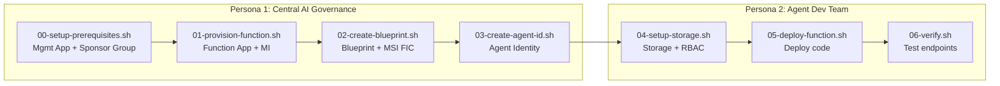

# Agent ID Demo — Azure Functions with Two-Step Token Exchange

This demo deploys an autonomous AI agent on Azure Functions using a managed identity and the two-step token exchange pattern. It is fully self-contained -- no other demos need to be run first.

## Architecture



## Prerequisites

- Azure CLI 2.x with the isolated test tenant session:
  ```bash
  source ./az-agentid-setup.sh
  ```
- [Azure Functions Core Tools](https://learn.microsoft.com/azure/azure-functions/functions-run-local) v4+ (`func`)
- `jq` and `python3` installed
- Current user must be Global Admin or Privileged Role Admin (for 00-setup-prerequisites.sh)

## Getting Started

```bash
cp .env.template .env
```

Optionally set custom names:
```bash
export FUNC_RESOURCE_GROUP=rg-myproject-func
export FUNC_APP_NAME=func-myproject-agentid
```

## How `.env` works

| Script | Writes to `.env` |
|---|---|
| `00-setup-prerequisites.sh` | MGMT_APP_ID, MGMT_APP_SECRET, SPONSOR_GROUP_ID |
| `01-provision-function.sh` | Function App config, MI_CLIENT_ID, MI_PRINCIPAL_ID |
| `02-create-blueprint.sh` | TENANT_ID, BLUEPRINT_OBJECT_ID, BLUEPRINT_APP_ID, BLUEPRINT_SP_ID |
| `03-create-agent-id.sh` | AGENT_IDENTITY_ID, AGENT_IDENTITY_APP_ID |
| `04-setup-storage.sh` | Storage account name |
| `05-deploy-function.sh` | (read-only) |
| `06-verify.sh` | (read-only) |

## Execution Order

### Persona 1 — Central AI Governance Team

```bash
cd demo-functions

# 0. Create management app + sponsor group (one-time per tenant)
bash persona-1-governance/00-setup-prerequisites.sh

# 1. Create Function App + User-Assigned Managed Identity
bash persona-1-governance/01-provision-function.sh

# 2. Create blueprint + add FIC for managed identity
bash persona-1-governance/02-create-blueprint.sh

# 3. Create agent identity from blueprint
bash persona-1-governance/03-create-agent-id.sh

# Hand off .env to Persona 2
```

### Persona 2 — Agent Development Team

```bash
cd demo-functions

# 4. Create storage account and assign RBAC to agent identity
bash persona-2-developer/04-setup-storage.sh

# 5. Deploy function code + configure app settings
bash persona-2-developer/05-deploy-function.sh

# 6. Verify endpoints
bash persona-2-developer/06-verify.sh
```

## Token Exchange

This demo uses the two-step MSI → Blueprint → Resource token exchange. See [docs/functions-agent-identity.md](../docs/functions-agent-identity.md) for the detailed flow and implementation.

Python SDKs don't support `fmi_path` yet, so this demo uses raw HTTP. See [docs/functions-agent-identity.md](../docs/functions-agent-identity.md#sdk-support-for-fmi_path) for the full SDK comparison.

## What the Function App Does

A Python Azure Function with zero secrets -- all authentication handled via managed identity + two-step token exchange. Includes [Agent 365 Observability](https://learn.microsoft.com/en-us/microsoft-agent-365/developer/observability?tabs=python) for governance-level agent monitoring.

### Endpoints

- **`GET /api/write-status`** -- Performs a live blob write via the two-step token exchange and returns the result (`success-write` / `fail-write`)
- **`GET /api/health`** -- Liveness probe

## Agent 365 Observability

This demo integrates the Microsoft Agent 365 Observability SDK to emit standardised OpenTelemetry spans for every agent invocation. This enables governance teams to monitor agent activity via Microsoft 365 admin center, Defender, and Purview.

### What is instrumented

| Scope | Span name | What it captures |
|---|---|---|
| `InvokeAgentScope` | `invoke_agent` | Each `/api/write-status` request -- agent identity, tenant, correlation ID |
| `ExecuteToolScope` | `execute_tool blob_write` | The blob write operation -- storage account, container, blob name |

### Configuration

| Env var | Default | Purpose |
|---|---|---|
| `ENABLE_A365_OBSERVABILITY_EXPORTER` | `false` | `true` = export to Agent 365 service (Frontier preview required). `false` = console exporter for local validation |
| `AGENT_DISPLAY_NAME` | `agentid-func-agent` | Service name in telemetry spans |

### Validating locally

Set `ENABLE_A365_OBSERVABILITY_EXPORTER=false` (the default). Spans are printed to the Function App console logs. Look for `invoke_agent` and `execute_tool` spans in the output -- see the [Microsoft docs](https://learn.microsoft.com/en-us/microsoft-agent-365/developer/observability?tabs=python#validate-locally) for sample log format.

### Token resolver

The token resolver currently returns `None` (console mode). When Frontier preview access is available, implement it to return a bearer token for the A365 service scope. See `_token_resolver()` in `function_app.py`.

## Cleanup

```bash
source demo-functions/.env

# Delete Function App resources
az group delete --name $FUNC_RESOURCE_GROUP --yes --no-wait

# Remove the blueprint (deletes all FICs with it)
# Use the Graph API to delete the application by BLUEPRINT_OBJECT_ID
```
