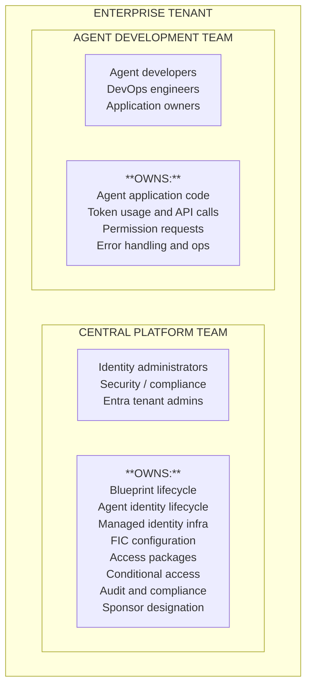
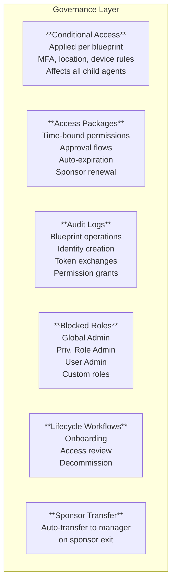

# Entra Agent ID -- Governance, Ownership, and Adoption Guide

## 1. Purpose

This document defines the end-to-end responsibility model for adopting Microsoft Entra Agent ID in an enterprise -- covering blueprint and agent identity ownership, required Entra roles and Graph permissions, permission governance, and the adoption roadmap from zero to production. It targets organizations with a central platform team that provisions identity infrastructure on behalf of multiple agent development teams.

## 2. Personas and Responsibilities

### 2.1 Persona Definitions



### 2.2 Responsibility Matrix (RACI)

| Activity | Central Platform | Agent Dev Team |
|---|---|---|
| Enable Agent ID in tenant | Responsible | -- |
| Create managed identity, blueprint, FIC, and principal | Responsible | Consulted |
| Configure identifier URI, scopes, and conditional access | Responsible | Consulted |
| Create and manage access packages | Accountable | Consulted |
| Assign managed identity to compute | Responsible | Consulted |
| Provide blueprint ID, MI client ID, and agent identity ID to dev team | Responsible | Informed |
| Designate sponsor for agent identities | Responsible | Consulted |
| Create agent identities | Responsible | Consulted |
| Implement token exchange logic | -- | Responsible |
| Request access packages for agents | -- | Responsible |
| Grant app role assignments (admin consent) | Responsible | Consulted |
| Monitor audit logs, disable/delete agents, respond to incidents | Responsible | Informed/Consulted |

### 2.3 Agent Modes

| Mode | Identity Type | Created By | Governance Notes |
|---|---|---|---|
| **Autonomous** | Agent Identity (service principal) | Central team | App-only permissions; uses `client_credentials` grant |
| **Interactive (OBO)** | Agent Identity acting on behalf of user | Central team | Carries user security context; requires exposed scope on blueprint |
| **Digital Colleague** | Agent User (`microsoft.graph.agentUser`) | Central team or management app | Has own mailbox, Teams, calendar; requires delegated permission consent |

A **Digital Colleague** is a User object (linked via `identityParentId`) with its own UPN, mailbox, Teams, and calendar. Creation requires `User.ReadWrite.All` (preview) and a management app token. Permissions are granted via admin consent URL or `oauth2PermissionGrants` API. Starts with zero default access; appears as a distinct user in audit logs.

## 3. Required Entra Roles and Graph Permissions

### 3.1 Central Platform Team Roles

| Entra Role | Purpose |
|---|---|
| **Privileged Role Administrator** | Grant Graph application permissions to client apps for blueprint management |
| **Cloud Application Administrator** | Grant Graph delegated permissions |
| **Agent ID Administrator** | Full lifecycle management of all agent blueprints and identities |
| **Identity Governance Administrator** | Create and manage access packages and entitlement catalogs |
| **Conditional Access Administrator** | Apply conditional access policies scoped to blueprints |

### 3.2 Agent Development Team Roles

| Role | Purpose |
|---|---|
| **Owner** (object-level, not Entra role) | Modify blueprint properties, manage credentials, add other owners; assigned per blueprint |

The agent development team does not require Entra directory roles. They consume agent identities provided by the central team and implement token exchange logic.

### 3.3 Sponsor Requirement

Every blueprint and agent identity must have a human sponsor. The central platform team designates sponsors during creation; sponsors can enable/disable agent identities via the My Account portal and receive access package expiration notifications. Sponsorship auto-transfers to the departing sponsor's manager.

### 3.4 Graph API Permissions by Activity

| Activity | Permission | Type | Used By |
|---|---|---|---|
| Create blueprint | `AgentIdentityBlueprint.Create` | Delegated | Central team |
| Add/remove credentials on blueprint | `AgentIdentityBlueprint.AddRemoveCreds.All` | Delegated | Central team |
| Update blueprint properties | `AgentIdentityBlueprint.ReadWrite.All` | Delegated | Central team |
| Create blueprint principal | `AgentIdentityBlueprintPrincipal.Create` | Delegated | Central team |
| Delete blueprint | `AgentIdentityBlueprint.DeleteRestore.All` | Delegated | Central team |
| Create agent identities | `AgentIdentity.CreateAsManager` (implicit via blueprint token) | Application | Central team (via blueprint token) |
| Grant app roles to agent identity | `Application.Read.All` + `AppRoleAssignment.ReadWrite.All` | Delegated | Central team |
| Read user info for sponsor | `User.Read` | Delegated | Both |
| Create agentic user (Digital Colleague) | `User.ReadWrite.All` | Delegated | Central team (preview only) |
| Grant delegated permissions to agent identity | `DelegatedPermissionGrant.ReadWrite.All` | Application | Central team |
| Script: expose API / add credentials on blueprint | `Application.ReadWrite.OwnedBy` | Application | Central team (automation) |

> **Preview note:** `User.ReadWrite.All` is required during preview to create Agent Users (Digital Colleagues). This requirement is expected to change before GA. `Application.ReadWrite.OwnedBy` is only needed if the management app scripts modify the blueprint it owns.

## 4. Lifecycle Flow -- Blueprint to Agent Identity

### 4.1 End-to-End Flow Diagram

```
CENTRAL PLATFORM TEAM                              AGENT DEV TEAM
=====================                              ==============

Phase 1: Foundation
  [1] Enable Agent ID in M365 admin center
  [2] Assign Agent ID Administrator role
  [3] Assign Privileged Role Administrator

Phase 2: Blueprint Provisioning
  [4] Create user-assigned managed identity
  [5] Create agent identity blueprint (set display name, sponsor, owner)
  [6] Add managed identity as FIC on blueprint
  [7] Create blueprint principal in tenant
  [8] Configure identifier URI and scopes (if interactive)
  [9] (Optional) Configure conditional access policy
  [10] Hand off to dev team: blueprint appId, MI client ID, MI resource ID, tenant ID

Phase 3: Agent Identity Creation
  [11] Create agent identity via Graph API      --> Hand off identity ID to dev team
       (using blueprint token, set sponsor)

Phase 3a: Digital Colleague (optional)
  [11a] Create Agent User (microsoft.graph.agentUser)
  [11b] Grant admin consent for delegated permissions

Phase 4-5: Deployment & Permissions              [12] Assign MI to compute
                                                  [13] Configure app settings
                                                  [14] Request access package
                                                  [15] Admin grants app roles if needed

Phase 6: Token Usage                             [16] Exchange tokens:
                                                       MSI -> T1 -> TR (Functions)
                                                       SA JWT -> TR    (K8s)
                                                  [17] Call downstream APIs

Phase 7: Ongoing Governance
  [18] Monitor audit logs
  [19] Review and renew access packages
  [20] Conditional access enforcement
  [21] Disable/delete agents when decommissioned
```

## 5. Code Snippets -- Central Platform Team

### 5.1 Create a User-Assigned Managed Identity

```bash
az identity create \
  --name energy-agent-mi \
  --resource-group rg-platform-identities \
  --location eastus

# Record the output:
# - clientId       -> used as MANAGED_IDENTITY_CLIENT_ID
# - principalId    -> used as FIC subject
# - id             -> full resource ID for compute assignment
```

### 5.2 Create an Agent Identity Blueprint (Graph API)

```http
POST https://graph.microsoft.com/beta/applications/
OData-Version: 4.0
Content-Type: application/json
Authorization: Bearer <platform-team-token>

{
  "@odata.type": "Microsoft.Graph.AgentIdentityBlueprint",
  "displayName": "Customer Support Agent Blueprint",
  "sponsors@odata.bind": [
    "https://graph.microsoft.com/v1.0/users/<sponsor-user-id>"
  ],
  "owners@odata.bind": [
    "https://graph.microsoft.com/v1.0/users/<platform-admin-user-id>"
  ]
}
```

Record the `appId` from the response. This is the **Blueprint Client ID**.

### 5.3 Create Blueprint (PowerShell)

```powershell
Install-Module Microsoft.Graph.Beta.Applications -Scope CurrentUser -Force

Connect-MgGraph -Scopes @(
    "AgentIdentityBlueprint.Create",
    "AgentIdentityBlueprint.AddRemoveCreds.All",
    "AgentIdentityBlueprint.ReadWrite.All",
    "AgentIdentityBlueprintPrincipal.Create",
    "User.Read"
) -TenantId "<tenant-id>"

$blueprint = New-MgBetaApplication -BodyParameter @{
    "@odata.type" = "Microsoft.Graph.AgentIdentityBlueprint"
    displayName   = "Customer Support Agent Blueprint"
    "sponsors@odata.bind" = @(
        "https://graph.microsoft.com/v1.0/users/<sponsor-user-id>"
    )
    "owners@odata.bind" = @(
        "https://graph.microsoft.com/v1.0/users/<platform-admin-user-id>"
    )
} -Headers @{ "OData-Version" = "4.0" }

Write-Host "Blueprint appId: $($blueprint.AppId)"
```

### 5.4 Add Managed Identity as Federated Identity Credential

```http
POST https://graph.microsoft.com/beta/applications/<blueprint-app-id>/federatedIdentityCredentials
OData-Version: 4.0
Content-Type: application/json
Authorization: Bearer <platform-team-token>

{
  "name": "energy-agent-fic",
  "issuer": "https://login.microsoftonline.com/<tenant-id>/v2.0",
  "subject": "<managed-identity-principal-id>",
  "audiences": ["api://AzureADTokenExchange"]
}
```

### 5.5 Create the Blueprint Principal

```http
POST https://graph.microsoft.com/beta/serviceprincipals/graph.agentIdentityBlueprintPrincipal
OData-Version: 4.0
Content-Type: application/json
Authorization: Bearer <platform-team-token>

{
  "appId": "<blueprint-app-id>"
}
```

### 5.6 Configure Identifier URI and Scope (Interactive Agents)

```http
PATCH https://graph.microsoft.com/beta/applications/<blueprint-app-id>
OData-Version: 4.0
Content-Type: application/json
Authorization: Bearer <platform-team-token>

{
  "identifierUris": ["api://<blueprint-app-id>"],
  "api": {
    "oauth2PermissionScopes": [
      {
        "adminConsentDescription": "Allow access to the agent on behalf of the signed-in user.",
        "adminConsentDisplayName": "Access agent",
        "id": "<generate-a-guid>",
        "isEnabled": true,
        "type": "User",
        "value": "access_agent"
      }
    ]
  }
}
```

### 5.7 Assign Managed Identity to Compute

```bash
# Azure Functions
az functionapp identity assign \
  --name my-agent-function \
  --resource-group rg-agents \
  --identities /subscriptions/<sub>/resourceGroups/rg-platform-identities/providers/Microsoft.ManagedIdentity/userAssignedIdentities/energy-agent-mi

# App Service
az webapp identity assign \
  --name my-agent-webapp \
  --resource-group rg-agents \
  --identities /subscriptions/<sub>/resourceGroups/rg-platform-identities/providers/Microsoft.ManagedIdentity/userAssignedIdentities/energy-agent-mi
```

### 5.8 Grant an App Role to an Agent Identity

After the central team creates an agent identity:

```http
POST https://graph.microsoft.com/v1.0/servicePrincipals/<agent-identity-id>/appRoleAssignments
Authorization: Bearer <admin-token>
Content-Type: application/json

{
  "principalId": "<agent-identity-id>",
  "resourceId": "<target-resource-sp-object-id>",
  "appRoleId": "<app-role-id>"
}
```

## 6. Code Snippets -- Agent Development Team

### 6.1 Create an Agent Identity at Runtime (C#)

```csharp
public static async Task<string> CreateAgentIdentityAsync(
    GraphServiceClient graphClient,
    string blueprintClientId,
    string sponsorUserId)
{
    var agentIdentity = await graphClient.ServicePrincipals
        .WithUrl("https://graph.microsoft.com/beta/servicePrincipals/Microsoft.Graph.AgentIdentity")
        .PostAsync(new ServicePrincipal()
        {
            DisplayName = "CustomerSupport-NorthAmerica",
            AdditionalData = new Dictionary<string, object>()
            {
                { "agentIdentityBlueprintId", blueprintClientId },
                { "sponsors@odata.bind", new[] {
                    $"https://graph.microsoft.com/v1.0/users/{sponsorUserId}"
                }}
            }
        });

    return agentIdentity.Id;
}
```

### 6.2 Create an Agent Identity (PowerShell -- for testing)

```powershell
# Using the Agent ID PowerShell module
Install-Module Microsoft.Graph.Beta.Applications -Scope CurrentUser -Force

# Authenticate as the blueprint
$blueprintToken = # ... obtain via MI + FIC exchange ...

# Create agent identity
$body = @{
    displayName = "CustomerSupport-NorthAmerica"
    agentIdentityBlueprintId = "<blueprint-app-id>"
    "sponsors@odata.bind" = @(
        "https://graph.microsoft.com/v1.0/users/<sponsor-user-id>"
    )
}

Invoke-MgGraphRequest -Method POST `
    -Uri "https://graph.microsoft.com/beta/servicePrincipals/Microsoft.Graph.AgentIdentity" `
    -Body ($body | ConvertTo-Json) `
    -Headers @{ "OData-Version" = "4.0" } `
    -ContentType "application/json"
```

### 6.3 Azure Functions -- Token Exchange and API Call (C#)

```csharp
using Azure.Core;
using Azure.Identity;
using Microsoft.Graph;

// Blueprint credential: MSI -> Blueprint exchange token (T1)
internal class AgentBlueprintCredential : TokenCredential
{
    private readonly ClientAssertionCredential _inner;

    public AgentBlueprintCredential(
        string tenantId, string blueprintClientId, string miClientId,
        ClientAssertionCredentialOptions options = null)
    {
        var msi = new ManagedIdentityCredential(miClientId);
        _inner = new ClientAssertionCredential(
            tenantId, blueprintClientId,
            async (ct) => (await msi.GetTokenAsync(
                new TokenRequestContext(
                    new[] { "api://AzureADTokenExchange/.default" }), ct)).Token,
            options);
    }

    public override AccessToken GetToken(TokenRequestContext c, CancellationToken t)
        => _inner.GetToken(c, t);
    public override ValueTask<AccessToken> GetTokenAsync(TokenRequestContext c, CancellationToken t)
        => _inner.GetTokenAsync(c, t);
}

// Agent identity credential: T1 -> Resource token (TR)
internal class AgentIdentityCredential : TokenCredential
{
    private readonly ClientAssertionCredential _inner;

    public AgentIdentityCredential(
        string tenantId, string blueprintClientId,
        string miClientId, string agentIdentityId)
    {
        var blueprint = new AgentBlueprintCredential(
            tenantId, blueprintClientId, miClientId,
            new ClientAssertionCredentialOptions
            {
                Transport = new FmiTransport(agentIdentityId)
            });

        _inner = new ClientAssertionCredential(
            tenantId, agentIdentityId,
            async (ct) => (await blueprint.GetTokenAsync(
                new TokenRequestContext(
                    new[] { "api://AzureADTokenExchange/.default" }), ct)).Token);
    }

    public override AccessToken GetToken(TokenRequestContext c, CancellationToken t)
        => _inner.GetToken(c, t);
    public override ValueTask<AccessToken> GetTokenAsync(TokenRequestContext c, CancellationToken t)
        => _inner.GetTokenAsync(c, t);
}

// FMI transport appends the agent identity ID to token requests
public class FmiTransport(string agentId) : HttpClientTransport()
{
    public override void Process(HttpMessage m)
    {
        m.Request.Uri.AppendQuery("fmi_path", agentId);
        base.Process(m);
    }
    public override ValueTask ProcessAsync(HttpMessage m)
    {
        m.Request.Uri.AppendQuery("fmi_path", agentId);
        return base.ProcessAsync(m);
    }
}
```

Usage in a Function:

```csharp
[Function("AgentAction")]
public async Task<HttpResponseData> Run(
    [HttpTrigger(AuthorizationLevel.Anonymous, "post")] HttpRequestData req)
{
    var credential = new AgentIdentityCredential(
        tenantId:         Environment.GetEnvironmentVariable("MyTenantId"),
        blueprintClientId: Environment.GetEnvironmentVariable("WEBSITE_AUTH_CLIENT_ID"),
        miClientId:        Environment.GetEnvironmentVariable("OVERRIDE_USE_MI_FIC_ASSERTION_CLIENTID"),
        agentIdentityId:   Environment.GetEnvironmentVariable("MyAgentId"));

    var graphClient = new GraphServiceClient(credential,
        new[] { "https://graph.microsoft.com/.default" });

    // Agent identity now has scoped permissions via access packages
    var users = await graphClient.Users.GetAsync();
    // ...
}
```

### 6.4 Kubernetes -- Token Exchange (Python)

```python
import requests
import os

TENANT_ID       = os.environ["TENANT_ID"]
BLUEPRINT_ID    = os.environ["BLUEPRINT_CLIENT_ID"]
AGENT_ID        = os.environ["AGENT_IDENTITY_ID"]
TOKEN_ENDPOINT  = f"https://login.microsoftonline.com/{TENANT_ID}/oauth2/v2.0/token"

def read_k8s_token():
    with open("/var/run/secrets/oidc/token") as f:
        return f.read().strip()

def get_agent_token(resource_scope):
    k8s_jwt = read_k8s_token()

    # Single-step exchange: K8s SA JWT -> Agent Identity token
    response = requests.post(TOKEN_ENDPOINT, data={
        "client_id":              BLUEPRINT_ID,
        "scope":                  resource_scope,
        "client_assertion_type":  "urn:ietf:params:oauth:client-assertion-type:jwt-bearer",
        "client_assertion":       k8s_jwt,
        "grant_type":             "client_credentials",
    })
    response.raise_for_status()
    return response.json()["access_token"]

# Usage
token = get_agent_token("https://graph.microsoft.com/.default")
headers = {"Authorization": f"Bearer {token}"}
users = requests.get("https://graph.microsoft.com/v1.0/users", headers=headers)
```

## 7. Governance Mechanisms

### 7.1 Architecture -- Governance Controls



### 7.2 Conditional Access

Conditional access policies are applied at the blueprint level and inherited by all child agent identities. Examples: require compliant device for interactive flows, block authentication from unapproved IPs, enforce session controls for sensitive data access.

### 7.3 Access Packages (Entitlement Management)

Access packages are the primary mechanism for granting permissions to agent identities. They provide time-bound, approval-gated, auditable permission assignments that require sponsor re-approval on renewal. Packageable resources include security group memberships, OAuth application permissions (including Graph API), and Microsoft Entra directory roles (from the allowed list).

### 7.3a Admin Consent for Agent Identities

Initial permission grants for agent identities (particularly Digital Colleagues) use admin consent. For ongoing lifecycle governance, use access packages.

**Browser-based admin consent:**

```
https://login.microsoftonline.com/{tenant-id}/v2.0/adminconsent
  ?client_id=<agent-identity-id>
  &scope=User.Read+GroupMember.Read.All+Mail.ReadWrite+Calendars.ReadWrite
  &redirect_uri=https://entra.microsoft.com/TokenAuthorize
  &state=xyz123
```

Use the agent identity's client ID (which equals `object_id` for agent identities). The `redirect_uri` should be `https://entra.microsoft.com/TokenAuthorize`.

**Programmatic consent via `oauth2PermissionGrants` API:**

```http
POST https://graph.microsoft.com/beta/oauth2PermissionGrants
Authorization: Bearer <management-app-token>

{
  "clientId": "<agent-identity-id>",
  "consentType": "Principal",
  "principalId": "<agent-user-object-id>",
  "resourceId": "<ms-graph-service-principal-object-id>",
  "scope": "User.Read GroupMember.Read.All Mail.ReadWrite Calendars.ReadWrite",
  "startTime": "2025-09-24T00:00:00",
  "expiryTime": "2026-09-24T00:00:00"
}
```

Requires `DelegatedPermissionGrant.ReadWrite.All` application permission on the management app.

### 7.4 Blocked Permissions and Roles

Agent identities cannot be assigned:

| Blocked | Reason |
|---|---|
| Global Administrator | Unrestricted tenant control |
| Privileged Role Administrator | Could escalate own permissions |
| User Administrator | Could modify all user accounts |
| Custom directory roles | Not supported for agents |
| `Application.ReadWrite.All` | Could manage all applications |
| `RoleManagement.ReadWrite.All` | Could modify role assignments |
| `User.ReadWrite.All` | Could modify all user profiles |
| `Directory.AccessAsUser.All` | Could bypass scope restrictions |

### 7.5 Audit and Monitoring

Entra audit logs record all agent identity operations: blueprint CRUD, agent identity creation/deletion, token exchanges (sign-in logs), app role assignments, consent grants, and access package assignments/expirations.

The central team should configure Log Analytics workspace integration, alert rules for unexpected agent identity creation, and periodic access reviews via ID Governance.

## 8. Adoption Roadmap

### Phase 0-1 -- Prerequisites and Tenant Configuration

| Step | Action | Owner | Dependency |
|---|---|---|---|
| 0.1 | Obtain Microsoft 365 Copilot license | Central Team | Budget approval |
| 0.2 | Enable Agent ID in M365 admin center | Central Team | License |
| 0.3 | Verify Entra Agent ID features are available | Central Team | Agent ID enabled |
| 1.1 | Assign Agent ID Administrator to platform operators | Central Team | 0.3 |
| 1.2 | Assign Privileged Role Administrator for Graph permission grants | Central Team | 0.3 |
| 1.3 | Configure entitlement management catalog for agent resources | Central Team | 1.1 |

### Phase 2 -- Blueprint Provisioning (per agent class)

| Step | Action | Owner | Dependency |
|---|---|---|---|
| 2.1 | Create user-assigned managed identity in Azure | Central Team | Phase 0-1 |
| 2.2 | Create agent identity blueprint via Graph API | Central Team | 2.1 |
| 2.3 | Add managed identity as FIC on blueprint | Central Team | 2.1, 2.2 |
| 2.4 | Create blueprint principal | Central Team | 2.2 |
| 2.5 | Configure scopes (if interactive), conditional access, access package | Central Team | 2.4 |
| 2.6 | Create agent identity instance | Central Team | 2.4 |
| 2.7 | Hand off config values (incl. agent identity ID) to dev team | Central Team | 2.1-2.6 |

### Phase 3 -- Agent Development and Deployment

| Step | Action | Owner | Dependency |
|---|---|---|---|
| 3.1 | Receive blueprint ID, MI client ID, agent identity ID, tenant ID | Dev Team | 2.7 |
| 3.2 | Assign managed identity to compute (Functions, K8s, App Service) | Dev Team / Central | 2.1, 3.1 |
| 3.3 | (Optional) Create Agent User and grant admin consent | Central Team | 2.6 |
| 3.4 | Implement token exchange credential classes | Dev Team | 3.1 |
| 3.5 | Designate sponsor for each agent identity | Central Team | Business alignment |
| 3.6 | Request access packages for agent identities | Dev Team | 2.5, 2.6 |
| 3.7 | Test token acquisition and downstream API calls | Dev Team | 3.4, 3.6 |
| 3.8 | Deploy to production | Dev Team | 3.7 |

### Phase 4 -- Ongoing Operations

| Step | Action | Owner | Frequency |
|---|---|---|---|
| 4.1 | Review audit logs for agent identity activity | Central Team | Weekly |
| 4.2 | Review and renew access packages | Central Team | On expiration |
| 4.3 | Rotate managed identity (if needed) | Central Team | Per policy |
| 4.4 | Update conditional access as threat landscape changes | Central Team | Quarterly |
| 4.5 | Decommission and delete agent identities when retired | Dev Team + Central Team | On retirement |

## 9. Decision Framework

### 9.1 Who Creates Blueprints?

**Central Platform Team.** Blueprints define the security boundary for an entire class of agents, require managed identity infrastructure access, and need consistent conditional access and access package configuration. The Agent ID Administrator role should be tightly held.

### 9.2 Who Creates Agent Identities?

**Central Platform Team (recommended).** Agent identities are runtime objects created via the blueprint token (no additional Entra role needed). Each agent identity should have a distinct sponsor designated by the central team.

### 9.3 Who Manages Permissions?

**Shared.** The central team creates access packages and approves grants. The dev team requests access packages for each agent identity. The central team reviews and renews on expiration.

### 9.4 Decision Checklist

1. Does a blueprint exist? → No: Central team creates one
2. Central team creates agent identity from blueprint
3. Central team hands off identity ID + config to dev team
4. Dev team requests access packages for the agent identity
5. Dev team deploys app with token exchange credentials

## 10. Security Guardrails Summary

| Guardrail | Enforced By | Description |
|---|---|---|
| No client secrets in production | Policy | Managed identities or certificates only |
| No high-privilege Entra roles | Entra platform | Global Admin, Priv Role Admin, etc. blocked |
| No high-privilege Graph permissions | Entra platform | Application.ReadWrite.All, RoleManagement.ReadWrite.All blocked |
| Time-bound access | Access packages | Permissions expire and require renewal |
| Human accountability | Entra platform | Every agent identity must have a sponsor |
| Lifecycle continuity | Lifecycle workflows | Sponsorship auto-transfers on departure |
| Blueprint-scoped policies | Conditional access | Policies on blueprint affect all child agents |
| Audit trail | Entra audit logs | All operations logged and queryable |
| Credential isolation | Managed identity + FIC | No secrets in code, config, or env vars |

## 11. References

- [Microsoft Entra Agent ID Documentation](https://learn.microsoft.com/entra/agent-id/)
- [Administrative Relationships (Owners, Sponsors, Managers)](https://learn.microsoft.com/entra/agent-id/identity-platform/agent-owners-sponsors-managers)
- [Create an Agent Identity Blueprint](https://learn.microsoft.com/entra/agent-id/identity-platform/create-blueprint)
- [Create and Delete Agent Identities](https://learn.microsoft.com/entra/agent-id/identity-platform/create-delete-agent-identities)
- [Authorization in Agent ID](https://learn.microsoft.com/entra/agent-id/identity-professional/authorization-agent-id)
- [Governing Agent Identities](https://learn.microsoft.com/entra/id-governance/agent-id-governance-overview)
- [Access Packages for Agent Identities](https://learn.microsoft.com/entra/agent-id/identity-professional/agent-access-packages)
- [Agent Identity on App Service and Azure Functions](https://learn.microsoft.com/azure/app-service/overview-agent-identity)
- [Agent OAuth Protocols](https://learn.microsoft.com/entra/agent-id/identity-platform/agent-oauth-protocols)
- [Entra Built-in Roles Reference](https://learn.microsoft.com/entra/identity/role-based-access-control/permissions-reference)
- [astaykov -- Entra Agent ID Preview Guide](https://github.com/astaykov/entra-agent-id-preview-guide)
