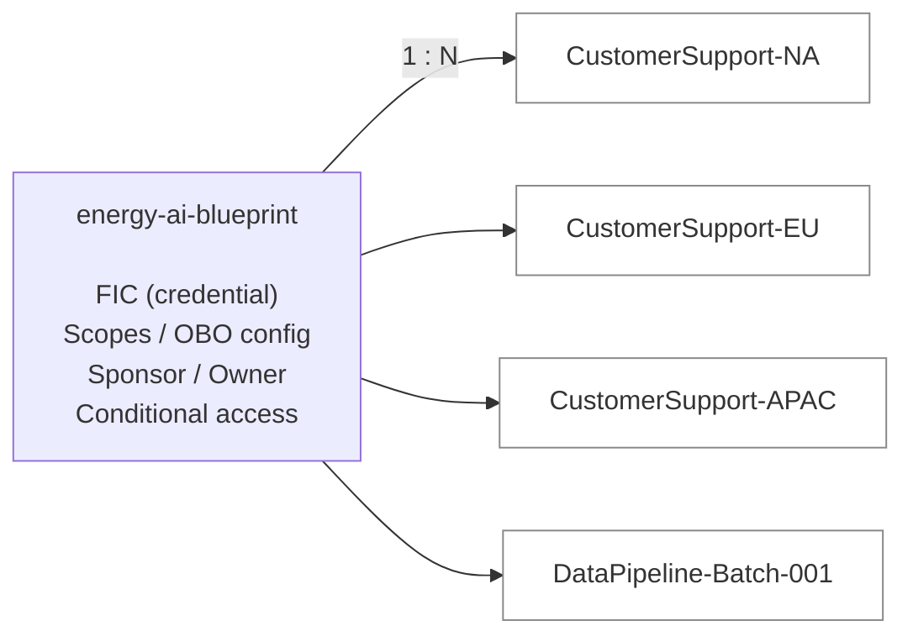
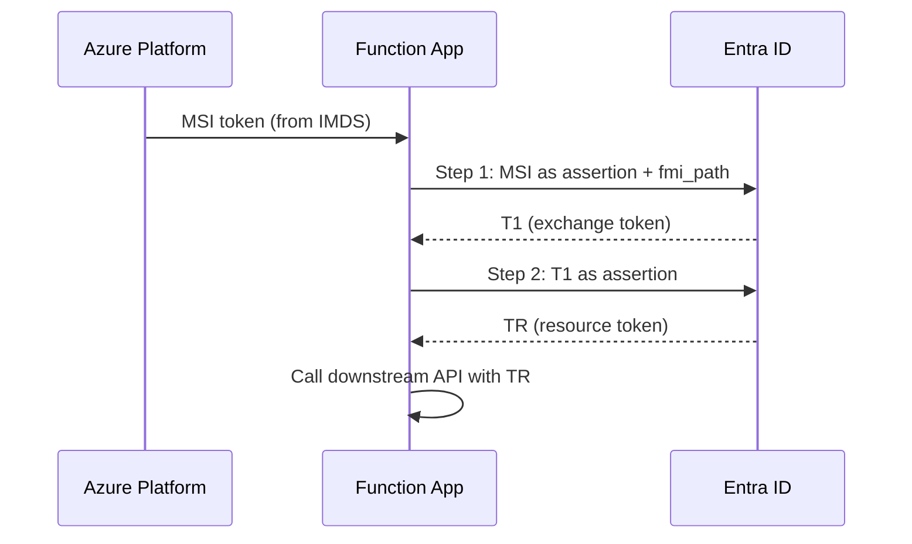

# Giving Your AI Agents a Real Identity: A Technical Introduction to Microsoft Entra Agent ID

*A practical guide for architects, identity engineers, and platform teams building autonomous AI agents in the enterprise.*

> For implementation guides, see [AKS flow guide](flow-aks-agent-identity.md) and [Functions guide](functions-agent-identity.md). For demo quick-starts, see [demo-aks/](../demo-aks/) or [demo-functions/](../demo-functions/).

---

> **TL;DR** -- Microsoft Entra Agent ID gives each autonomous AI agent its own first-class identity in your tenant, separate from users, apps, and shared service accounts. The model uses two core objects: **blueprints** (the template, owned by a central platform team) and **agent identities** (runtime instances, created by dev teams). Agents authenticate via workload identity federation -- no secrets, no certificates. On Kubernetes it is a single-step token exchange; on Azure Functions it is two steps. Governance is built in: time-bound permissions via access packages, conditional access at the blueprint level, blocked high-privilege roles, and a mandatory human sponsor for every agent. The feature is currently in preview.

---

## The Problem: Agents Are Not Users, and They Are Not Apps

Every enterprise building AI agents hits the same identity problem: the agent needs credentials to call downstream APIs, and today's options are all bad.

- **Shared service accounts** -- multiple agents share one SP, so a compromise in one exposes all, and audit logs cannot distinguish which agent acted.
- **Embedded secrets** -- client secrets in environment variables that expire, go unrotated, and bring production down at 2 AM.
- **Over-permissioned managed identities** -- one MI gets permissions for every downstream API the agent might ever need, making the blast radius the entire identity.

Traditional identity primitives were not designed for autonomous agents. You need something purpose-built.

---

## What Is Entra Agent ID?

Microsoft Entra Agent ID is a purpose-built identity framework for autonomous AI agents. It introduces two new object types in your Entra tenant:

### The Blueprint (the Template)

An **Agent Identity Blueprint** is an Entra application registration that serves as the template for a class of agents. Think of it as the class definition. The blueprint:

- Holds the **Federated Identity Credential (FIC)** -- the trust link to your compute infrastructure
- Defines the scopes and OBO settings for the agent class
- Has a designated **sponsor** (a human accountable for the agents)
- Is the target for conditional access policies

Critically, the FIC is configured on the blueprint, not on the agent identity. Agent identities have no credentials of their own.

### The Agent Identity (the Runtime Instance)

An **Agent Identity** is a runtime service principal created from a blueprint. Think of it as the instance. One blueprint can produce many agent identities -- a 1:N relationship. Each agent identity:

- Has its own service principal ID
- Gets its own scoped permissions (via access packages)
- Appears in audit logs as a distinct actor
- Can be independently enabled, disabled, or deleted



---

## How It Works on Kubernetes

On Kubernetes, the agent uses workload identity federation with a **single-step token exchange**.

The flow:

1. The pod gets a projected service account JWT from the cluster's OIDC issuer.
2. Entra trusts the external Kubernetes IdP via the FIC on the blueprint (the FIC's issuer is the cluster OIDC endpoint, and the subject is `system:serviceaccount:namespace:sa-name`).
3. The agent POSTs the K8s JWT to the Entra token endpoint and gets back a resource token directly.

```python
# Single-step exchange: K8s SA JWT -> Agent Identity token
response = requests.post(TOKEN_ENDPOINT, data={
    "client_id":              BLUEPRINT_ID,
    "scope":                  "https://graph.microsoft.com/.default",
    "client_assertion_type":  "urn:ietf:params:oauth:client-assertion-type:jwt-bearer",
    "client_assertion":       k8s_jwt,
    "grant_type":             "client_credentials",
})
token = response.json()["access_token"]
```

One step. No secrets. The K8s service account token is projected into the pod by the kubelet and rotated automatically.

You can optionally run the **[Microsoft Entra SDK for AgentID](https://learn.microsoft.com/en-us/entra/msidweb/agent-id-sdk/overview)** as a sidecar container (`mcr.microsoft.com/entra-sdk/auth-sidecar:1.0.0-azurelinux3.0-distroless`) that handles all the Entra protocol details and exposes simple HTTP endpoints. This decouples your agent code from Entra entirely. The tradeoff: an extra container per pod versus embedding the token exchange in your application code.

### Sidecar Token Flow on AKS

When using the Entra SDK sidecar, the token acquisition flow has four stages:

1. **Infrastructure setup** -- the blueprint's FIC points to the AKS cluster's OIDC issuer with subject `system:serviceaccount:<namespace>:<sa-name>`. The pod spec includes `azure.workload.identity/use: "true"`, and the AKS mutating webhook injects `AZURE_FEDERATED_TOKEN_FILE` into all containers.
2. **FIC exchange** -- the sidecar reads the projected K8s JWT and exchanges it for an intermediate token using scope `api://AzureADTokenExchange/.default` with the `fmi_path` parameter targeting the specific agent identity.
3. **Resource token** -- the sidecar exchanges the intermediate token for a resource token (e.g., `https://graph.microsoft.com/.default` or `https://storage.azure.com/.default`).
4. **App calls sidecar** -- your app makes a local HTTP call (e.g., `http://localhost:5000/AuthorizationHeaderUnauthenticated/Storage?AgentIdentity=<id>`) and gets back a ready-to-use `Authorization` header. The token's `oid` claim is the agent identity's SP ID -- RBAC assignments must target the agent identity, not the blueprint.

---

## How It Works on Azure Functions

On Azure Functions, the credential source is a **user-assigned managed identity** instead of a projected service account token. Because the managed identity is already an Entra identity (no external IdP), the token exchange is a **two-step process**: MSI → Blueprint exchange token (T1) → Resource token (TR). The `fmi_path` parameter in step 1 targets the specific agent identity.



| Aspect | Kubernetes | Azure Functions |
|---|---|---|
| Credential source | Projected SA token (K8s OIDC) | Managed Identity (IMDS) |
| Federation issuer | K8s cluster OIDC endpoint | `login.microsoftonline.com` |
| Token exchange steps | 1 step (K8s JWT to agent token) | 2 steps (MSI to T1 to TR) |
| Secret management | None (projected token) | None (IMDS) |
| Setup complexity | Higher (OIDC issuer, SA, volumes) | Lower (assign managed identity) |

For the full implementation walkthrough -- HTTP requests, C# credential classes, and setup scripts -- see the [Functions guide](functions-agent-identity.md).

> **Three-party interactive model:** For interactive (OBO) agents, an additional **AI Application** (a third app registration) represents the front-end the user interacts with. The user authenticates to the AI app via authorization code flow, targeting the blueprint's `access_agent` scope (`api://<blueprint-id>/access_agent`). The AI app then exchanges the authorization code for tokens and passes the user context downstream.

---

## The Third Mode: Digital Colleagues (Agent Users)

Entra Agent ID also supports a **Digital Colleague** -- a `microsoft.graph.agentUser` user object with its own mailbox, Teams presence, OneDrive, and calendar. Unlike a service principal, the Digital Colleague is a full user in the directory.

### Creating a Digital Colleague

The Digital Colleague is created as a User object (not a service principal) with `identityParentId` pointing to the Agent Identity:

```http
POST https://graph.microsoft.com/beta/users

{
  "@odata.type": "microsoft.graph.agentUser",
  "displayName": "Digital Worker 01",
  "userPrincipalName": "aiDigitalWorker01@tenant.onmicrosoft.com",
  "mailNickname": "aiDigitalWorker01",
  "accountEnabled": true,
  "identityParentId": "<agent-identity-id>"
}
```

> **Note:** The `User.ReadWrite.All` permission is a **temporary preview requirement** for creating Agentic Users. Expect this to be scoped down as the feature moves toward GA.

### Authentication: The Three-Step `user_fic` Flow

Digital Colleagues authenticate via a three-step flow using the custom `user_fic` grant type:

1. **Blueprint credential → Blueprint FIC token.** The compute credential (MSI token or K8s JWT) is exchanged for a Blueprint FIC token, using the `fmi_path` parameter to target the agent identity.
2. **Blueprint FIC → Agent Identity FIC token.** The Blueprint FIC token is exchanged for an Agent Identity FIC token.
3. **Both FIC tokens → Agent User token.** Both tokens are combined in a final exchange using `grant_type=user_fic`, `requested_token_use=on_behalf_of`, `username=<upn>`, and `user_federated_identity_credential=<agent_identity_fic>`.

The resulting token is a delegated token with the Digital Colleague as the user context -- downstream APIs see the agent as a named user, not an anonymous service principal. Admin consent for delegated permissions is required and can be granted via the admin consent URL flow or the `oauth2PermissionGrants` API.

### Comparing the Three Modes

| Mode | Identity Type | Has User Context | Use Case |
|---|---|---|---|
| Autonomous | Service principal (app-only) | No | Background processing, data pipelines |
| Interactive (OBO) | Service principal acting on behalf of user | Yes (calling user) | Chat interfaces, user-facing copilots |
| Digital Colleague | `agentUser` (own mailbox, Teams, calendar) | Yes (its own user identity) | Agents that send email, join meetings, collaborate in Teams |

### The Three-Layer Mental Model

```
Blueprint             -- governance and policy    (who agents CAN be)
Agent Identity        -- auditable principal      (who the agent IS)
Hosting App           -- execution environment    (WHERE the agent runs)
```

Your hosting app is replaceable; the agent identity is not.

---

## Who Owns What: The Governance Model

Entra Agent ID enforces a two-persona ownership model.

**Central Platform Team** (identity admins, security, tenant admins) owns blueprint lifecycle, managed identity infrastructure, FIC configuration, access packages, conditional access policies, audit/compliance, and sponsor designation.

**Agent Development Team** (developers, DevOps) owns agent identity creation, application code, and permission requests via access packages. The dev team does **not** create blueprints -- that requires the Agent ID Administrator role, held by the central team.

### Required Entra Roles (Central Team)

| Role | Purpose |
|---|---|
| Agent ID Administrator | Full lifecycle management of blueprints and identities |
| Privileged Role Administrator | Grant Graph application permissions to management clients |
| Cloud Application Administrator | Grant Graph delegated permissions |
| Identity Governance Administrator | Create and manage access packages |
| Conditional Access Administrator | Apply policies scoped to blueprints |

The agent development team requires **no Entra directory roles**.

### The Handoff

The central team provisions a blueprint, creates agent identities, and hands the dev team five values: Blueprint Client ID, Managed Identity Client ID, Managed Identity Resource ID, Agent Identity ID, and Tenant ID. From that point, the dev team is self-service for implementing token exchange, deploying applications, and requesting access packages. The central team retains oversight through audit logs, access reviews, and conditional access enforcement.

---

## Security Guardrails

### Blocked High-Privilege Roles and Permissions

Agent identities **cannot** be assigned these roles or permissions (platform-enforced):

| Blocked | Reason |
|---|---|
| Global Administrator | Unrestricted tenant control |
| Privileged Role Administrator | Could escalate its own permissions |
| User Administrator | Could modify all user accounts |
| `Application.ReadWrite.All` | Could manage all applications |
| `RoleManagement.ReadWrite.All` | Could modify role assignments |
| `Directory.AccessAsUser.All` | Could bypass scope restrictions |

Custom directory roles are also not supported for agent identities.

### Additional Guardrails

- **Time-bound access via access packages** -- automatic expiration, approval workflows, auditable assignments, and renewal with re-approval.
- **Human accountability** -- every agent identity and blueprint must have a designated human **sponsor** who can enable/disable agents and receives expiration notifications. Sponsorship transfers to their manager if they leave.
- **Blueprint-scoped conditional access** -- policies applied at the blueprint level are inherited by all child agent identities, enabling uniform enforcement across an entire agent class.

---

## Getting Started: A Practical Roadmap

### Phase 0 -- Prerequisites

Obtain a Microsoft 365 Copilot license, enable Agent ID in the M365 admin center, and verify Agent ID features are available in your tenant.

### Phase 1 -- Tenant Configuration

Assign the Agent ID Administrator and Privileged Role Administrator roles to your platform operators. Configure an entitlement management catalog for agent resources.

### Phase 2 -- Blueprint Provisioning (per agent class)

This is the central team's core workflow:

1. Create a user-assigned managed identity in Azure
2. Create the agent identity blueprint via Graph API (set display name, sponsor, owner)
3. Add the managed identity as a FIC on the blueprint
4. Create the blueprint principal in the tenant
5. Configure scopes if using interactive (OBO) agent patterns
6. Apply a conditional access policy to the blueprint
7. Create an access package with the required resource roles
8. Hand off configuration values to the dev team

### Phase 3 -- Agent Development and Deployment

The dev team receives the configuration values, assigns the managed identity to compute, implements agent identity creation logic and token exchange credential classes, requests access packages, tests end-to-end, and deploys.

### Phase 4 -- Ongoing Operations

Review audit logs weekly. Renew access packages on expiration. Rotate managed identities per policy. Update conditional access as the threat landscape changes. Decommission agent identities when agents are retired -- delete agent identities before deleting the blueprint.

---

## Conclusion: What Comes Next

Microsoft Entra Agent ID solves a real problem that enterprise teams have been working around with duct tape. The blueprint/agent-identity model gives you per-agent audit trails, scoped permissions, time-bound access, and clear ownership boundaries. The Digital Colleague pattern extends this further with dedicated `agentUser` identities for agents that need their own mailbox or Teams presence.

The feature is in preview -- expect the API surface to evolve. Start with a single blueprint for one agent class, get the token exchange working end-to-end, and validate the governance workflow. That gives you the pattern you will replicate across your organization.

---

## References

- [Microsoft Entra Agent ID Documentation](https://learn.microsoft.com/entra/agent-id/)
- [Agent Identity on App Service and Azure Functions](https://learn.microsoft.com/azure/app-service/overview-agent-identity)
- [Create an Agent Identity Blueprint](https://learn.microsoft.com/entra/agent-id/identity-platform/create-blueprint)
- [Agent OAuth Protocols](https://learn.microsoft.com/entra/agent-id/identity-platform/agent-oauth-protocols)
- [Blueprint Concepts](https://learn.microsoft.com/entra/agent-id/identity-platform/agent-blueprint)
- [Agent Identities](https://learn.microsoft.com/entra/agent-id/identity-platform/agent-identities)
- [Governing Agent Identities](https://learn.microsoft.com/entra/id-governance/agent-id-governance-overview)
- [Access Packages for Agent Identities](https://learn.microsoft.com/entra/agent-id/identity-professional/agent-access-packages)
- [Administrative Relationships (Owners, Sponsors, Managers)](https://learn.microsoft.com/entra/agent-id/identity-platform/agent-owners-sponsors-managers)
- [Azure Samples -- ms-identity-agent-identities](https://github.com/Azure-Samples/ms-identity-agent-identities)
- [astaykov/entra-agent-id-preview-guide](https://github.com/astaykov/entra-agent-id-preview-guide) -- Hands-on implementation guide with REST API calls, PowerShell scripts, and Insomnia collection
- [End-to-End Flow: Agent Identity on AKS](flow-aks-agent-identity.md)
- [End-to-End Flow: Agent Identity on Functions](functions-agent-identity.md)
