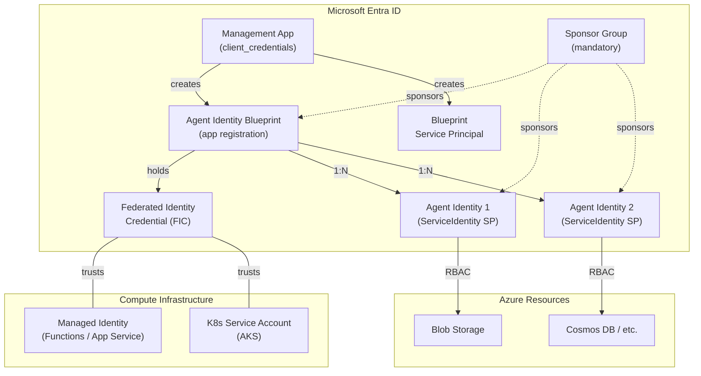
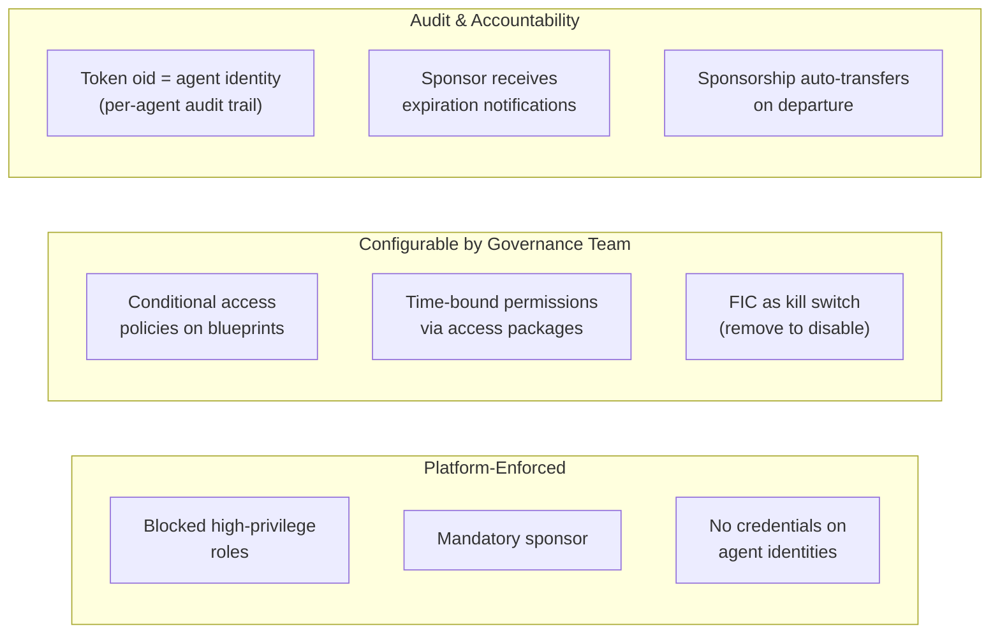
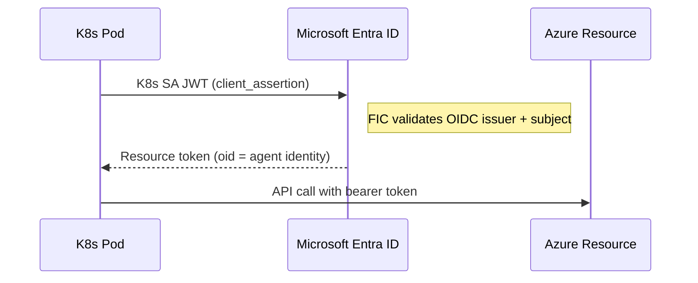
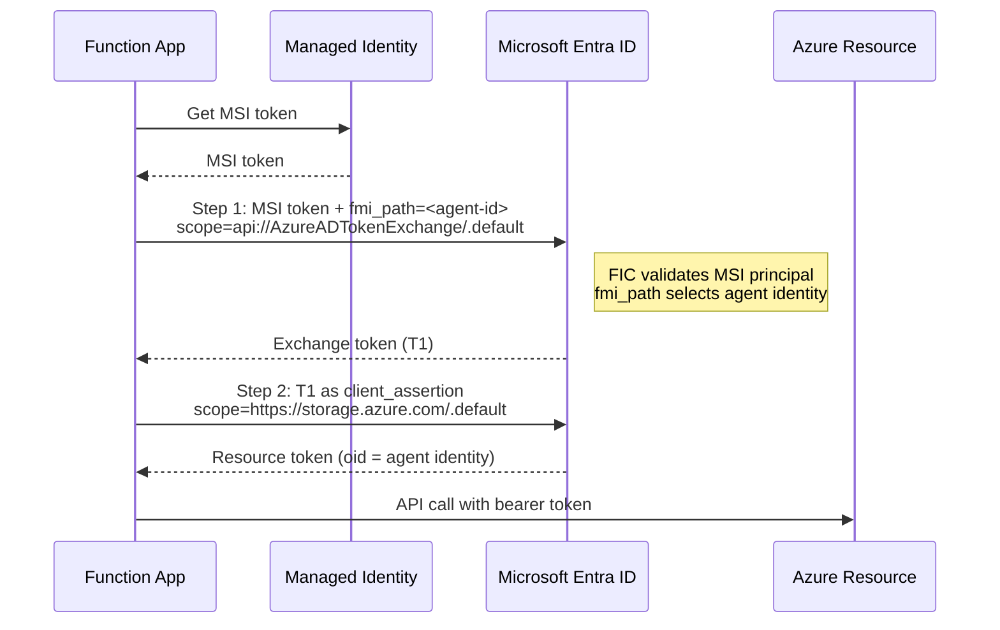

# Agent ID Concepts

A quick reference for the core objects, roles, and trust model behind Microsoft Entra Agent ID.

## Object Hierarchy

## Objects

### Agent Identity Blueprint

An Entra application registration (`@odata.type: Microsoft.Graph.AgentIdentityBlueprint`) that serves as the **template** for a class of agents. Think class definition.

- Holds the **Federated Identity Credential** (FIC) -- the trust link to compute infrastructure
- Defines scopes and OBO settings for the agent class
- Target for conditional access policies
- 1:N relationship -- one blueprint can have many agent identities
- Created via `POST /beta/applications/` with `OData-Version: 4.0` header
- `id` and `appId` are the **same GUID** (unlike regular app registrations)

Agent identities have **no credentials of their own**. The FIC always lives on the blueprint.

### Agent Identity

A runtime service principal (`servicePrincipalType: ServiceIdentity`) created from a blueprint. This is what the agent authenticates as.

- Created via `POST /beta/serviceprincipals/Microsoft.Graph.AgentIdentity`
- Linked to the blueprint via `agentAppId` (the blueprint's `appId`)
- RBAC roles for resource access go here, **not on the blueprint**
- No Entra directory roles required to create one -- uses the blueprint token

### Federated Identity Credential (FIC)

A trust link configured on the blueprint that replaces secrets and certificates. It tells Entra "this external identity can authenticate as this blueprint."

| Platform | Issuer | Subject | What it means |
|---|---|---|---|
| **AKS / Kubernetes** | Cluster OIDC issuer URL | `system:serviceaccount:<ns>:<sa>` | K8s service account JWT can be exchanged for blueprint tokens |
| **Azure Functions** | `https://login.microsoftonline.com/<tenant>/v2.0` | Managed identity principal ID | MSI token can be exchanged for blueprint tokens |

Removing the FIC disables all agent identities under that blueprint (after token cache expiry -- ~60 min TTL). Re-adding it restores access without recreating anything.

### Sponsor

A human or security group accountable for the agent. **Mandatory** -- the API returns `Request_BadRequest` without one.

- Designated during blueprint and agent identity creation via `sponsors@odata.bind`
- Can be a user (`/v1.0/users/<id>`) or a group (`/v1.0/groups/<id>`)
- Sponsors can enable/disable agent identities via the My Account portal
- Receive access package expiration notifications
- Sponsorship auto-transfers to the departing sponsor's manager

In the demos, `00-setup-prerequisites.sh` creates a security group (`agentid-sponsors`) and adds the current admin as a member. This group is then used as the sponsor for all blueprints and agent identities.

### Management App

A dedicated Entra app registration used by the governance team's scripts to call the Graph API. Required because **Agent ID APIs reject delegated tokens** -- you cannot use `az account get-access-token` with `Directory.AccessAsUser.All`.

The management app authenticates via `client_credentials` flow and needs:

| Permission | Type | Why |
|---|---|---|
| `Application.ReadWrite.All` | Application | Create/manage blueprint app registrations |
| `AgentIdentityBlueprint.Create` | Delegated | Create blueprints (via admin consent) |
| `AgentIdentityBlueprint.ReadWrite.All` | Delegated | Update blueprint properties |
| `AgentIdentityBlueprint.AddRemoveCreds.All` | Delegated | Add FICs to blueprints |
| `AgentIdentityBlueprintPrincipal.Create` | Delegated | Create blueprint service principals |

In the demos, `00-setup-prerequisites.sh` creates this app, grants `Application.ReadWrite.All`, and writes the credentials to `.env`.

### Owner

A human or group who can modify the blueprint configuration (properties, credentials, add other owners). Assigned per blueprint, typically a member of the governance team.

## Entra Roles

### Why each role is needed

| Role | Required for | Which script uses it |
|---|---|---|
| **Agent ID Administrator** | Full lifecycle management of blueprints and agent identities | `02-create-blueprint.sh`, `03-create-agent-id.sh` |
| **Privileged Role Administrator** | Grant Graph application permissions (`Application.ReadWrite.All`) to the management app | `00-setup-prerequisites.sh` |
| **Cloud Application Administrator** | Grant Graph delegated permissions to apps | `00-setup-prerequisites.sh` |
| **Identity Governance Administrator** | Create and manage access packages and entitlement catalogs | Not used in demos (enterprise governance) |
| **Conditional Access Administrator** | Apply conditional access policies scoped to blueprints | Not used in demos (enterprise governance) |

The first three roles are needed **only during initial setup** (`00-setup-prerequisites.sh` and `02-create-blueprint.sh`). After that, all operations use the management app's `client_credentials` token.

### Agent development team

The dev team requires **no Entra directory roles**. They:

- Create agent identities using the blueprint token (provided by the governance team)
- Deploy application code with workload identity federation
- Request permissions via access packages (enterprise scenarios)

## Governance Guardrails

## Blocked Roles and Permissions

Agent identities **cannot** be assigned these (platform-enforced):

| Blocked | Reason |
|---|---|
| Global Administrator | Unrestricted tenant control |
| Privileged Role Administrator | Could escalate its own permissions |
| User Administrator | Could modify all user accounts |
| `Application.ReadWrite.All` | Could manage all applications |
| `RoleManagement.ReadWrite.All` | Could modify role assignments |
| `Directory.AccessAsUser.All` | Could bypass scope restrictions |

Custom directory roles are also not supported for agent identities.

## Token Exchange

### Kubernetes (single step)

The projected service account JWT is exchanged directly for a resource token. The FIC on the blueprint trusts the cluster's OIDC issuer.

### Azure Functions (two steps)

The extra step is needed because Functions uses Entra-to-Entra federation (MSI issuer is Entra itself, not an external OIDC provider). The `fmi_path` parameter tells Entra which child agent identity to impersonate.

## References

- [Agent Identity Blueprint concepts](https://learn.microsoft.com/entra/agent-id/identity-platform/agent-blueprint)
- [Administrative Relationships (Owners, Sponsors, Managers)](https://learn.microsoft.com/entra/agent-id/identity-platform/agent-owners-sponsors-managers)
- [Agent OAuth Protocols](https://learn.microsoft.com/entra/agent-id/identity-platform/agent-oauth-protocols)
- [Entra Agent ID overview](https://learn.microsoft.com/entra/agent-id/)
