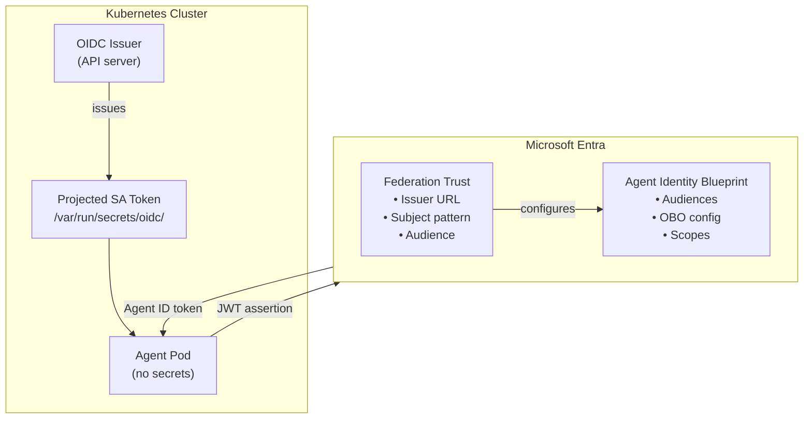
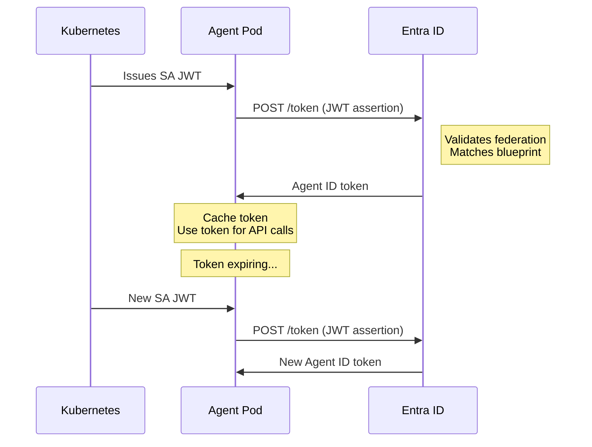
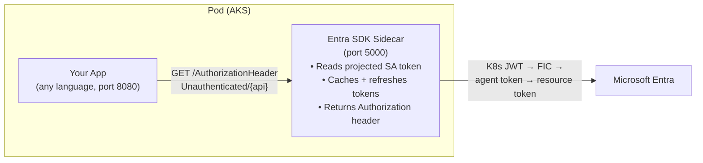
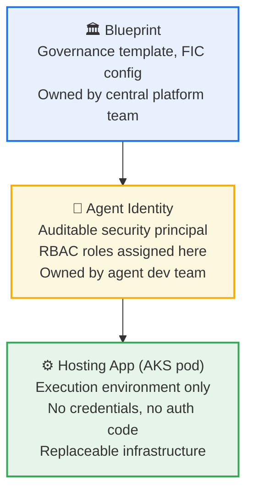

# Entra Agent ID on Kubernetes
## Workload Identity Federation — End to End

---

# What We'll Cover

1. **What is Agent ID?** — Blueprints & runtime identities
2. **Workload Identity Federation** — How K8s earns Entra's trust
3. **Control Plane Setup** — One-time Entra configuration
4. **Kubernetes Setup** — Service accounts & projected tokens
5. **Token Exchange** — Federation in action (no sidecar)
6. **Agent Responsibilities** — Caching, refresh, error handling
7. **Why the Sidecar Exists** — Tradeoffs & coupling
8. **The Sidecar Pattern** — Recommended approach for K8s

---

# The Problem

> How does a Kubernetes-hosted agent prove who it is to Microsoft Entra
> — **without embedding secrets** in the cluster?

### Traditional approach (bad)
- Client secrets or certificates baked into pods
- Secret rotation is manual and error-prone
- Secrets can leak via logs, crash dumps, image layers

### Federated approach (good)
- Kubernetes **issues** a JWT for the pod
- Entra **trusts** that JWT via a pre-configured federation
- No secrets ever touch the workload

---

# Key Concepts

| Concept | What It Is |
|---|---|
| **Agent Identity Blueprint** | The "class" definition in Entra — audiences, scopes, OBO settings |
| **Agent Identity** | A runtime instance of a blueprint — the actual token-bearing identity |
| **Workload Identity Federation** | Entra trusting an external IdP (Kubernetes) to assert identities |
| **Projected Service Account Token** | A Kubernetes-issued JWT mounted into the pod at runtime |
| **OBO (On-Behalf-Of)** | Token exchange allowing the agent to act on behalf of a user |

---

# Architecture Overview



---

# Step 1 — Control Plane Setup (Central Team)

## 1a. Create an Agent Identity Blueprint

Done once in Entra by the platform / security team.

- **Blueprint name:** `energy-ai-agent-blueprint`
- **Allowed audiences:** `api://energy-platform`, `https://management.azure.com/`
- **OBO enabled:** `true`
- **Downstream scopes:** defined per business need

> "Blueprint represents the agent *class*; identities are runtime instances."
> — Christian Posta, Part 1

---

# Step 1 — Control Plane Setup (continued)

## 1b. Configure the Federation Trust

Tell Entra: *"Trust JWTs from this Kubernetes cluster."*

| Field | Value |
|---|---|
| **Issuer URL** | `https://kubernetes.default.svc.cluster.local` (or cluster OIDC issuer) |
| **Subject** | `system:serviceaccount:agents:energy-agent-sa` |
| **Audience** | `api://AzureADTokenExchange` |
| **Bound to** | Blueprint `energy-ai-agent-blueprint` |

IMPORTANT: This does **not** issue tokens — it only allows Entra to **accept** the K8s-issued assertion.

---

# Step 2 — Kubernetes Setup (App Team)

## 2a. Service Account

```yaml
apiVersion: v1
kind: ServiceAccount
metadata:
  name: energy-agent-sa
  namespace: agents
```

Nothing special — a standard Kubernetes ServiceAccount.

---

# Step 2 — Kubernetes Setup (continued)

## 2b. Deployment with Projected Token Volume

```yaml
spec:
  serviceAccountName: energy-agent-sa
  containers:
  - name: agent
    image: my-agent:latest
    volumeMounts:
    - name: k8s-token
      mountPath: /var/run/secrets/oidc
      readOnly: true
  volumes:
  - name: k8s-token
    projected:
      sources:
      - serviceAccountToken:
          audience: api://AzureADTokenExchange
          expirationSeconds: 3600
          path: token
```

### What this produces
- A file at `/var/run/secrets/oidc/token`
- A **JWT issued by Kubernetes** — the federated credential
- **No Entra token exists yet** — that comes next

---

# Step 3 — Token Exchange (The Core Flow)

## Inputs the agent has at runtime

| Input | Source |
|---|---|
| Kubernetes JWT | `/var/run/secrets/oidc/token` |
| Blueprint Client ID | Environment variable / config |
| Entra Tenant ID | Environment variable / config |
| Entra Token Endpoint | Well-known URL |

### No secrets. No certificates. No passwords.

---

# Step 3 — Token Exchange Request

```http
POST https://login.microsoftonline.com/{tenant-id}/oauth2/v2.0/token
Content-Type: application/x-www-form-urlencoded

client_id=<AGENT_IDENTITY_BLUEPRINT_CLIENT_ID>
&grant_type=client_credentials
&client_assertion_type=urn:ietf:params:oauth:client-assertion-type:jwt-bearer
&client_assertion=<KUBERNETES_SERVICE_ACCOUNT_JWT>
&scope=api://energy-platform/.default
```

### What Entra does internally
1. **Validates** the JWT — issuer, subject, audience
2. **Matches** to the federation trust + blueprint
3. **Issues** an Agent Identity access token

---

# Step 3 — The Resulting Token

The Agent Identity access token contains:

- [+] **Agent ID** — unique runtime identity
- [+] **Blueprint ID** — which agent class this belongs to
- [+] **Roles / Permissions** — scoped to blueprint config
- [+] **Short expiration** — typically minutes, not hours

> This is exactly the step the **sidecar** normally performs on behalf of the agent.

---

# Sequence Diagram



---

# Step 4 — What the Agent Must Implement

## 4a. Token Caching

- Cache the token **in memory only**
- Track the `exp` claim
- **Never write tokens to disk**

## 4b. Expiration Tracking

```python
if token.expires_in < 300:   # 5-minute buffer
    refresh_token()
```

Short-lived tokens mean OBO flows **will fail** if the token expires mid-call.

---

# Step 4 — Agent Responsibilities (continued)

## 4c. Refresh Logic

Refresh = **repeat the same federation exchange**:

1. Read the Kubernetes JWT again (kubelet auto-rotates it)
2. Call Entra token endpoint again
3. Replace the cached token

> NOTE: There are **no refresh tokens** in this model.

## 4d. Failure Handling

| Code | Meaning | Action |
|---|---|---|
| `401` | Token expired | Re-exchange immediately |
| `403` | Federation trust misconfigured | Alert + escalate |
| `429` | Entra throttling | Exponential backoff |
| Network error | Transient failure | Retry with jitter |

---

# Why the Sidecar Exists

Without the sidecar, **every agent team** must correctly implement:

- Token exchange with Entra (FIC + `fmi_path`)
- Caching & expiration tracking
- Refresh logic
- Error handling & retries
- Keeping up with Entra API changes

### The coupling is real

Your agent directly depends on:
- Entra token endpoint semantics
- Federation grant types & `fmi_path` parameter
- Claim format specifics

**Any Entra change can break your agent.**

The **Microsoft Entra SDK for AgentID** sidecar eliminates all of this -- your app makes one HTTP call and gets a ready-to-use token.

---

# Sidecar vs. No Sidecar

Sidecar is the **recommended** approach for Kubernetes deployments.

| Aspect | With Sidecar | Without Sidecar |
|---|---|---|
| Token exchange | Handled by sidecar | Agent code does it |
| Token caching | Sidecar manages | Agent must implement |
| Refresh logic | Automatic | Agent must implement |
| `fmi_path` handling | Automatic | Agent must implement |
| Error handling | Centralized | Per-agent |
| Entra coupling | Sidecar absorbs | Agent is tightly coupled |
| Complexity | Lower per agent | Higher per agent |
| Flexibility | Less (opinionated) | More (full control) |

### Sidecar gotchas

- Use **TCP socket** probes (not HTTP -- `/healthz` returns 400)
- Scopes use indexed format: `DownstreamApis__Storage__Scopes__0`
- Set `ASPNETCORE_URLS=http://+:5000` explicitly

---

# The Sidecar Pattern (Recommended)

**Microsoft Entra SDK for AgentID** runs as a companion container in your pod.

- Image: `mcr.microsoft.com/entra-sdk/auth-sidecar:1.0.0-azurelinux3.0-distroless`
- Your app calls a local HTTP endpoint -- **any language, zero SDK**
- Sidecar handles: FIC exchange, `fmi_path`, token caching, refresh

```
GET http://localhost:5000/AuthorizationHeaderUnauthenticated/{api}
    ?AgentIdentity=<agent-identity-id>
```

**Result:** zero auth code in your application.

---

# Sidecar Architecture



Your app **never** touches Entra directly -- the sidecar is the auth boundary.

---

# Three-Layer Model



Your pod is replaceable; the agent identity is not.

---

# Key Takeaways

1. **Federation setup is deterministic and explicit**
   - Issuer + Subject + Audience → Trust

2. **No secrets ever touch the workload**
   - Kubernetes JWT is the only credential

3. **Without the sidecar, you own the full token lifecycle**
   - Exchange, cache, refresh, error handling

4. **It's fully supported — but easy to get wrong**
   - The sidecar exists to prevent each team from re-inventing this

---

# References

- **Christian Posta** — *Microsoft Entra Agent ID on Kubernetes*
  - [Parts 3 & 4: Agent Gateway](https://blog.christianposta.com/entra-agent-id-agw/)
- **Reference Implementation**
  - [github.com/christian-posta/entra-agent-id-agw](https://github.com/christian-posta/entra-agent-id-agw)
- **Microsoft Docs**
  - [Workload Identity Federation](https://learn.microsoft.com/en-us/entra/workload-id/workload-identity-federation)
  - [AKS Workload Identity](https://learn.microsoft.com/en-us/azure/aks/workload-identity-overview)
  - [Microsoft Entra SDK for AgentID](https://learn.microsoft.com/en-us/entra/msidweb/agent-id-sdk/overview)

---

# Thank You

### Questions?
