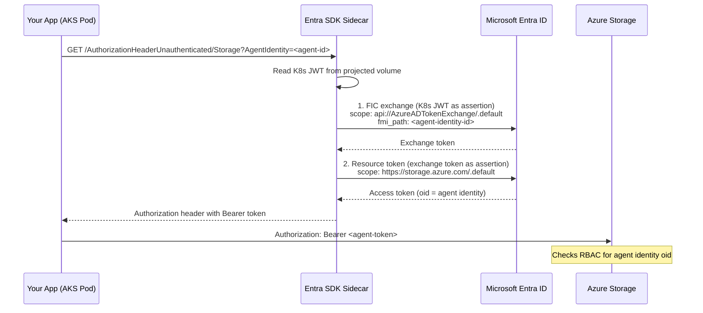

# End-to-End Flow: Agent Identity on AKS (Workload Identity + Sidecar)

Below is a grounded, implementation-oriented explanation of Microsoft Entra Agent ID on Kubernetes, tailored to this scenario:

An AI agent running on AKS using Workload Identity Federation, with the goal of assigning it an Agent Identity via an Agent Identity Blueprint, and enabling it to access downstream Azure resources.

This document mirrors the Functions flow described in `guidance.exta.md` but covers the AKS-specific mechanics: OIDC-based federation, the Entra SDK sidecar, and Kubernetes service account binding.

---

## 1. What "Agent Identity" is

Microsoft Entra Agent ID introduces a first-class identity for AI agents, distinct from:

- the hosting application (AKS pod, Container App, etc.)
- the user (if any)
- the infrastructure identity (Kubernetes service account)

An Agent Identity is:

- Represented as its own service principal in Microsoft Entra ID (`servicePrincipalType: ServiceIdentity`)
- Created from an Agent Identity Blueprint
- Used to acquire tokens (app-only or on-behalf-of-user)
- Auditable as "the agent did this," not just "the pod did this"

The Microsoft Entra SDK for Agent ID (sidecar) handles:

- Token acquisition from the K8s service account JWT
- Federated identity credential (FIC) exchange
- Agent identity token acquisition via `fmi_path`
- Downstream API calls with cached tokens
- Abstracting all identity logic away from your app code

---

## 2. Key building blocks and how they relate

### 2.1 Agent Identity Blueprint (design-time construct)

Blueprint = template + authority.

- Every Agent Identity must be created from a blueprint
- Blueprints define the identity class and hold the FIC (trust link)
- Created using Microsoft Graph (`/beta/applications/`)
- Sponsors are **mandatory** -- the API rejects requests without them

Think of it as: *"This is what agents of type X are allowed to be."*

**AKS-specific:** The FIC on the blueprint points to the AKS cluster's OIDC issuer URL and a specific Kubernetes service account subject.

### 2.2 Agent Identity (runtime identity)

- An instance created from the blueprint
- Has its own service principal (`servicePrincipalType: ServiceIdentity`)
- Has no credentials of its own -- it derives authority from the blueprint's FIC
- Can be assigned Azure RBAC roles and API permissions
- Tokens carry agent-specific claims (`oid` = agent identity, not blueprint)

**Important:** For blueprint-type apps, `id` and `appId` are the **same GUID** (unlike regular app registrations).

### 2.3 Hosting Environment (your AKS pod)

Your AKS pod:

- Does **not** authenticate directly as the agent
- Instead, it runs the Entra SDK sidecar alongside the app container
- The app makes simple HTTP calls to the sidecar at `localhost:5000`
- The sidecar uses the K8s service account JWT (injected by workload identity webhook) to authenticate

**This separation is intentional.**

### 2.4 The Three-Layer Mental Model

```
Blueprint             — governance and policy (who agents CAN be)
Agent Identity        — auditable security principal (who the agent IS)
Hosting App (AKS pod) — execution environment only (WHERE the agent runs)
```

Your AKS pod is replaceable; the agent identity is not.

---

## 3. End-to-end flow (AKS + Workload Identity + Sidecar)

Below is the correct order and interaction model, derived from the official docs, the Microsoft Entra SDK for AgentID documentation, and validated through live implementation.

### Step 1 -- Create an Agent Identity Blueprint (one-time)

**Who:** Entra / Identity Platform team (Persona 1 -- Central AI Governance)

**How:** Microsoft Graph API via client_credentials flow

**Required roles:**
- Agent ID Administrator or Agent ID Developer
- Application Administrator / Cloud Application Administrator (for app objects)
- Privileged Role Administrator (to grant Graph permissions)

**Key requirement:** A dedicated management app registration with `Application.ReadWrite.All` (application permission, admin consented). **Agent ID APIs reject delegated tokens** -- you cannot use `az account get-access-token` with `Directory.AccessAsUser.All`.

**API call:**
```http
POST https://graph.microsoft.com/beta/applications/
Content-Type: application/json
OData-Version: 4.0

{
  "@odata.type": "Microsoft.Graph.AgentIdentityBlueprint",
  "displayName": "my-agent-blueprint",
  "sponsors@odata.bind": [
    "https://graph.microsoft.com/v1.0/groups/<sponsor-group-id>"
  ]
}
```

**Outcome:**
- Blueprint object created
- Record the blueprint `appId` (same as `id` for blueprint type)

**⚠️ Wait 30 seconds** for Entra replication before creating the service principal.

Then create the blueprint service principal:
```http
POST https://graph.microsoft.com/beta/serviceprincipals/graph.agentIdentityBlueprintPrincipal

{ "appId": "<blueprint-appId>" }
```

### Step 2 -- Register downstream APIs (if not already)

**Who:** API / resource owner team

Each downstream API or Azure resource the agent needs to access:

- For Azure resources (Storage, Cosmos DB, Key Vault): no app registration needed -- use built-in scopes like `https://storage.azure.com/.default`
- For custom APIs: register as App Registration, expose scopes or app roles
- Grant permissions to agent identities (not users, not the blueprint)

### Step 3 -- Create the Agent Identity (per agent instance)

**Who:** Central AI Governance Team (Persona 1) or platform automation

**How:** Microsoft Graph API via client_credentials flow

**API call:**
```http
POST https://graph.microsoft.com/beta/serviceprincipals/Microsoft.Graph.AgentIdentity
Content-Type: application/json
OData-Version: 4.0

{
  "displayName": "my-agent-01",
  "agentAppId": "<blueprint-appId>",
  "sponsors@odata.bind": [
    "https://graph.microsoft.com/v1.0/groups/<sponsor-group-id>"
  ]
}
```

**Key field:** `agentAppId` (NOT `agentIdentityBlueprintId`) -- value is the blueprint's `appId`.

**Outcome:**
- Agent identity service principal created
- Record the agent identity's `appId` (this is the `AGENT_IDENTITY_ID`)

This step is often triggered when a new AI agent is deployed or when a new tenant is onboarded.

### Step 4 -- Assign permissions to the Agent Identity

**Who:** Resource owners (Azure / API owners)

**Examples:**
- Azure RBAC roles (Storage Blob Data Contributor, Cosmos DB Data Reader, etc.)
- API permissions (Graph, internal APIs)

**Critical:** Permissions are assigned to the **agent identity**, NOT the blueprint. When the sidecar uses the `AgentIdentity` parameter, the resulting token's `oid` is the agent identity -- Azure RBAC checks this `oid` for authorisation.

```bash
az role assignment create \
  --role "Storage Blob Data Contributor" \
  --assignee "<agent-identity-appId>" \
  --scope "/subscriptions/.../storageAccounts/..."
```

### Step 5 -- Configure AKS Workload Identity

**Who:** Azure platform / app team (may be Persona 1 or Persona 2 depending on org)

**5a. Enable OIDC issuer and workload identity on AKS:**
```bash
az aks create \
  --name my-cluster \
  --enable-oidc-issuer \
  --enable-workload-identity \
  ...
```

**5b. Create Kubernetes namespace and service account:**
```yaml
apiVersion: v1
kind: ServiceAccount
metadata:
  name: agent-sa
  namespace: agent-demo
  labels:
    azure.workload.identity/use: "true"
  annotations:
    azure.workload.identity/client-id: "<blueprint-appId>"
```

The `azure.workload.identity/use: "true"` label tells the AKS workload identity webhook to inject `AZURE_CLIENT_ID`, `AZURE_TENANT_ID`, and `AZURE_FEDERATED_TOKEN_FILE` into all containers in pods using this service account.

**5c. Add Federated Identity Credential to the blueprint:**

This is the trust link that says "K8s service account X in cluster Y can authenticate as this blueprint."

```http
POST https://graph.microsoft.com/beta/applications/<blueprint-object-id>/federatedIdentityCredentials

{
  "name": "aks-workload-identity",
  "issuer": "<AKS_OIDC_ISSUER_URL>",
  "subject": "system:serviceaccount:agent-demo:agent-sa",
  "audiences": ["api://AzureADTokenExchange"]
}
```

**Result:** The pod's projected service account JWT can now be exchanged for blueprint tokens via Entra ID.

### Step 6 -- Deploy with Microsoft Entra SDK for AgentID (sidecar)

**Who:** Application team (Persona 2)

The sidecar runs as a companion container in the same pod. Your app container calls its HTTP API at `localhost:5000` -- zero embedded auth logic.

**6a. ConfigMap with sidecar configuration:**
```yaml
apiVersion: v1
kind: ConfigMap
metadata:
  name: agent-config
data:
  # Entra ID settings
  AzureAd__TenantId: "<tenant-id>"
  AzureAd__ClientId: "<blueprint-appId>"
  AzureAd__ClientCredentials__0__SourceType: "SignedAssertionFilePath"
  # Downstream API: Storage
  DownstreamApis__Storage__BaseUrl: "https://<account>.blob.core.windows.net"
  DownstreamApis__Storage__Scopes__0: "https://storage.azure.com/.default"
  DownstreamApis__Storage__RequestAppToken: "true"
```

**⚠️ Scopes must use indexed format** (`Scopes__0`, `Scopes__1`) -- ASP.NET Core array convention.

**6b. Deployment with sidecar:**
```yaml
spec:
  template:
    metadata:
      labels:
        azure.workload.identity/use: "true"
    spec:
      serviceAccountName: agent-sa
      containers:
      - name: my-agent-app
        image: myapp:latest
        ports:
        - containerPort: 8080
      - name: entra-sdk-sidecar
        image: mcr.microsoft.com/entra-sdk/auth-sidecar:1.0.0-azurelinux3.0-distroless
        ports:
        - containerPort: 5000
        envFrom:
        - configMapRef:
            name: agent-config
        env:
        - name: ASPNETCORE_URLS
          value: "http://+:5000"
        livenessProbe:
          tcpSocket:          # NOT httpGet -- /healthz returns 400
            port: 5000
```

**Sidecar gotchas:**
- **TCP probes only** -- the sidecar's `/healthz` returns 400 to K8s HTTP probes (JWT middleware intercepts the request). TCP socket probes work reliably.
- **Set `ASPNETCORE_URLS`** -- the image defaults to port 8080, which conflicts with your app container.
- **No projected volume needed** -- the workload identity webhook automatically injects the service account token.

### Step 7 -- Runtime call sequence

At runtime, when your app needs to call a downstream API as the agent:

1. **App calls sidecar** -- `GET http://localhost:5000/AuthorizationHeaderUnauthenticated/Storage?AgentIdentity=<agent-identity-appId>`

2. **Sidecar reads K8s JWT** -- from the webhook-projected path (`AZURE_FEDERATED_TOKEN_FILE`)

3. **Sidecar performs FIC exchange** -- K8s JWT → Entra token endpoint with `fmi_path=<agent-identity-appId>` and `scope=api://AzureADTokenExchange/.default`

4. **Sidecar acquires resource token** -- exchange token → resource-scoped token (e.g., `https://storage.azure.com/.default`)

5. **Sidecar returns auth header** -- `{"authorizationHeader": "Bearer eyJ0..."}`

6. **App uses the token** -- includes the `Authorization` header in its API call

7. **Downstream service sees agent identity** -- the token's `oid` is the agent identity, not the blueprint or pod identity

**Key point:**
✅ The agent identity is the security principal, not the AKS pod.

---

## 4. Interaction diagram



---

## 5. Organizational responsibilities

| Responsibility | Typical Owner |
|---|---|
| Create Agent Identity Blueprints | Entra / IAM team |
| Grant Graph permissions | Entra Global / Privileged Admin |
| Configure FIC (trust link) | Entra / IAM team |
| Provision AKS cluster | Azure platform team |
| Create Agent Identities | Entra / IAM team (central governance) |
| Assign Azure RBAC / API permissions | Resource / API owners |
| Deploy sidecar + app code | Application team |
| Audit & compliance | Security / GRC |
| Emergency revocation (FIC removal) | Entra / IAM team |

This division is intentional and aligns with least-privilege and separation of duties.

---

## 6. Governance controls

### FIC removal as emergency kill switch

Removing the FIC from the blueprint **instantly disables all agent identities** created from that blueprint. No new tokens can be acquired. However:

- **Cached tokens remain valid for up to 60 minutes** (standard Entra ID access token TTL)
- For immediate effect, restart the pods to force the sidecar to re-acquire tokens (which will now fail)
- Re-creating the FIC with the same parameters restores access

This is the primary governance mechanism for disabling agent access at scale.

### Audit trail

Every token issued carries agent-specific claims:
- `oid` -- the agent identity (not the blueprint or pod)
- `appid` -- the blueprint's app ID
- `xms_ficinfo` -- FIC metadata
- `xms_par_app_azp` -- parent application context

These claims enable fine-grained audit logging that distinguishes "which agent did what" rather than just "which pod did what."

---

## 7. The three-layer mental model

```
Blueprint             — governance and policy    (who agents CAN be)
Agent Identity        — auditable principal      (who the agent IS)
Hosting App (AKS pod) — execution environment    (WHERE the agent runs)
```

Your AKS pod is replaceable; the agent identity is not.

The blueprint sets boundaries. The agent identity acts within them. The pod is just where code runs.

---

## 8. AKS vs Functions -- key differences

| Aspect | AKS | Azure Functions |
|---|---|---|
| Federation source | AKS OIDC issuer (external) | Managed Identity (Entra-to-Entra) |
| FIC subject | `system:serviceaccount:ns:sa` | Managed Identity principal ID |
| FIC issuer | AKS OIDC issuer URL | `login.microsoftonline.com/.../v2.0` |
| Token exchange | K8s JWT → FIC → agent token | MSI token → FIC → agent token |
| SDK deployment | Sidecar container in same pod | Sidecar service or SDK library |
| Token injection | Workload identity webhook | Managed identity endpoint |
| Scaling unit | Pod (multi-container) | Function invocation |

Both converge on the same Entra ID token exchange endpoint and produce identical agent identity tokens.

---

## References

- [Microsoft Entra Agent ID Docs](https://learn.microsoft.com/entra/agent-id/)
- [Microsoft Entra SDK for AgentID](https://learn.microsoft.com/en-us/entra/msidweb/agent-id-sdk/overview)
- [AKS Workload Identity](https://learn.microsoft.com/en-us/azure/aks/workload-identity-overview)
- [Entra SDK Python Integration](https://learn.microsoft.com/en-us/entra/msidweb/agent-id-sdk/scenarios/using-from-python)
- [astaykov/entra-agent-id-preview-guide](https://github.com/astaykov/entra-agent-id-preview-guide)
