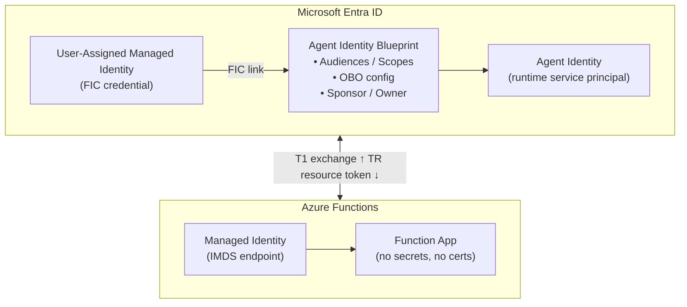

# Entra Agent ID on Azure Functions

## Functions vs Kubernetes

On Functions, the credential source is a Managed Identity (already native to Entra) rather than an external K8s OIDC issuer. No external IdP trust is needed, but the token exchange requires two steps instead of one.

| | Kubernetes | Azure Functions |
|---|---|---|
| **Credential source** | K8s SA JWT (external OIDC) | MSI token (Entra-native) |
| **Exchange steps** | 1 | 2 |

---

## Key Concepts

| Concept | What It Is |
|---|---|
| **Agent Identity Blueprint** | The template (class) in Entra — defines permissions, OBO settings, scopes |
| **Agent Identity** | A runtime instance -- the actual service principal (`servicePrincipalType: ServiceIdentity`) the agent authenticates as. RBAC roles for resource access must be assigned here, not on the blueprint |
| **User-Assigned Managed Identity** | An Entra identity assigned to the Function App — the credential source |
| **Federated Identity Credential (FIC)** | Trust link on the blueprint binding it to the managed identity. Removing the FIC disables all agent identities under that blueprint (after token cache expiry -- 60-min TTL). See [Blueprint concepts](https://learn.microsoft.com/entra/agent-id/identity-platform/agent-blueprint). |
| **Sponsor** | A human user or group accountable for the agent. **Mandatory** for both blueprints and agent identities -- the API returns `Request_BadRequest` without one |
| **Owner** | A human user or group who can manage the blueprint configuration |

---

## Architecture Overview



---

## Step 1 — Control Plane Setup (Central / Security Team)

### 1a. Create a User-Assigned Managed Identity

```bash
az identity create \
  --name energy-agent-mi \
  --resource-group rg-agents \
  --location eastus
```

Record:
- **Client ID** — for token acquisition
- **Principal ID** — for the FIC subject

### 1b. Create an Agent Identity Blueprint

```http
POST https://graph.microsoft.com/beta/applications/
OData-Version: 4.0
Content-Type: application/json

{
  "@odata.type": "Microsoft.Graph.AgentIdentityBlueprint",
  "displayName": "energy-ai-agent-blueprint",
  "sponsors@odata.bind": [
    "https://graph.microsoft.com/v1.0/users/<sponsor-user-id>"
  ],
  "owners@odata.bind": [
    "https://graph.microsoft.com/v1.0/users/<owner-user-id>"
  ]
}
```

Record the `appId` (this is the **Blueprint Client ID**). Wait ~30 seconds for directory replication before creating the blueprint service principal.

### 1c. Add the Managed Identity as a Federated Identity Credential

```http
POST https://graph.microsoft.com/beta/applications/<blueprint-app-id>/federatedIdentityCredentials
OData-Version: 4.0
Content-Type: application/json

{
  "name": "energy-agent-fic",
  "issuer": "https://login.microsoftonline.com/<tenant-id>/v2.0",
  "subject": "<managed-identity-principal-id>",
  "audiences": ["api://AzureADTokenExchange"]
}
```

> **K8s contrast:** On K8s, the issuer is the cluster OIDC endpoint and subject is `system:serviceaccount:ns:sa`. On Functions, both are Entra-native.

> **Dev/test alternative:** You can add a client secret to the blueprint instead of MSI for local development (never in production). See [astaykov/entra-agent-id-preview-guide](https://github.com/astaykov/entra-agent-id-preview-guide).

### 1d. Create the Blueprint Principal

```http
POST https://graph.microsoft.com/beta/serviceprincipals/graph.agentIdentityBlueprintPrincipal
OData-Version: 4.0
Content-Type: application/json

{
  "appId": "<blueprint-app-id>"
}
```

## Step 2 — Azure Functions Setup (App Team)

### 2a. Assign the Managed Identity to the Function App

```bash
az functionapp identity assign \
  --name my-agent-function \
  --resource-group rg-agents \
  --identities /subscriptions/<sub>/resourceGroups/rg-agents/providers/Microsoft.ManagedIdentity/userAssignedIdentities/energy-agent-mi
```

### 2b. Configure App Settings

| Setting | Value |
|---|---|
| `MyTenantId` | Your Entra tenant ID |
| `OVERRIDE_USE_MI_FIC_ASSERTION_CLIENTID` | Managed Identity Client ID |
| `WEBSITE_AUTH_CLIENT_ID` | Blueprint Client ID (appId) |
| `MyAgentId` | Agent Identity ID (after creation) |

## Step 3 — Token Exchange (The Two-Step Flow)

### Step 3a — Get Blueprint Exchange Token (T1)

Use the managed identity token as a `client_assertion`:

```http
POST https://login.microsoftonline.com/{tenant-id}/oauth2/v2.0/token
Content-Type: application/x-www-form-urlencoded

client_id=<BLUEPRINT_CLIENT_ID>
&scope=api://AzureADTokenExchange/.default
&fmi_path=<AGENT_IDENTITY_ID>
&client_assertion_type=urn:ietf:params:oauth:client-assertion-type:jwt-bearer
&client_assertion=<MANAGED_IDENTITY_TOKEN>
&grant_type=client_credentials
```

`client_assertion` is the MSI token from IMDS (audience `api://AzureADTokenExchange`). `fmi_path` specifies which agent identity to impersonate. Returns **T1** (blueprint exchange token).

> **Scope restriction:** `fmi_path` only works with `api://AzureADTokenExchange/.default`. Requesting resource scopes directly with `fmi_path` returns `AADSTS70066` -- the two-step exchange cannot be skipped.

### Step 3b — Exchange T1 for Resource Token (TR)

```http
POST https://login.microsoftonline.com/{tenant-id}/oauth2/v2.0/token
Content-Type: application/x-www-form-urlencoded

client_id=<AGENT_IDENTITY_ID>
&scope=https://resource.example.com/.default
&client_assertion_type=urn:ietf:params:oauth:client-assertion-type:jwt-bearer
&client_assertion=<T1>
&grant_type=client_credentials
```

Returns **TR** — the resource access token, issued to the Agent Identity.

### What Entra validates

1. MSI token is valid and matches the FIC on the blueprint
2. Blueprint is the parent of the specified agent identity
3. Agent identity has the requested permissions

> **Delegated tokens not supported:** Blueprint and agent identity management calls require `client_credentials` with a dedicated management app that has `Application.ReadWrite.All` and the `Agent ID Administrator` role.

> **Token lifetime:** Resource tokens (TR) have a 60-minute TTL.

## Step 4 — Code Implementation (C#)

### 4a. Blueprint Credential (Gets T1)

Wraps MSI → Blueprint exchange into an `Azure.Identity` `TokenCredential`:

```csharp
internal class AgentIdentityBlueprintCredential : TokenCredential
{
    private static string TokenExchangeAudience =
        Environment.GetEnvironmentVariable("TokenExchangeAudience")
        ?? "api://AzureADTokenExchange";

    private static string ExchangeScope =
        $"{TokenExchangeAudience}/.default";

    private readonly ClientAssertionCredential _inner;

    public AgentIdentityBlueprintCredential(
        string tenantId,
        string blueprintClientId,
        string managedIdentityClientId)
    {
        var msiCred = new ManagedIdentityCredential(managedIdentityClientId);

        _inner = new ClientAssertionCredential(
            tenantId,
            blueprintClientId,
            async (ct) => (await msiCred.GetTokenAsync(
                new TokenRequestContext(new[] { ExchangeScope }), ct)).Token
        );
    }

    public override AccessToken GetToken(
        TokenRequestContext ctx, CancellationToken ct)
        => _inner.GetToken(ctx, ct);

    public override ValueTask<AccessToken> GetTokenAsync(
        TokenRequestContext ctx, CancellationToken ct)
        => _inner.GetTokenAsync(ctx, ct);
}
```

### 4b. Agent Identity Credential (Gets TR)

Wraps Blueprint → Agent Identity exchange:

```csharp
internal class AgentIdentityCredential : TokenCredential
{
    private readonly ClientAssertionCredential _inner;

    public AgentIdentityCredential(
        string tenantId,
        string blueprintClientId,
        string managedIdentityClientId,
        string agentIdentityId)
    {
        var blueprintCred = new AgentIdentityBlueprintCredential(
            tenantId, blueprintClientId, managedIdentityClientId,
            new ClientAssertionCredentialOptions
            {
                Transport = new FmiTransport(agentIdentityId)
            });

        _inner = new ClientAssertionCredential(
            tenantId,
            agentIdentityId,
            async (ct) => (await blueprintCred.GetTokenAsync(
                new TokenRequestContext(
                    new[] { "api://AzureADTokenExchange/.default" }), ct)).Token
        );
    }

    public override AccessToken GetToken(
        TokenRequestContext ctx, CancellationToken ct)
        => _inner.GetToken(ctx, ct);

    public override ValueTask<AccessToken> GetTokenAsync(
        TokenRequestContext ctx, CancellationToken ct)
        => _inner.GetTokenAsync(ctx, ct);
}
```

### 4c. Using in a Function

```csharp
[Function("ProcessData")]
public async Task<HttpResponseData> Run(
    [HttpTrigger(AuthorizationLevel.Anonymous, "post")] HttpRequestData req)
{
    var credential = new AgentIdentityCredential(
        tenantId: Environment.GetEnvironmentVariable("MyTenantId")!,
        blueprintClientId: Environment.GetEnvironmentVariable("WEBSITE_AUTH_CLIENT_ID")!,
        managedIdentityClientId: Environment.GetEnvironmentVariable("OVERRIDE_USE_MI_FIC_ASSERTION_CLIENTID")!,
        agentIdentityId: Environment.GetEnvironmentVariable("MyAgentId")!
    );

    // Use the credential to call downstream APIs as the agent identity
    var graphClient = new GraphServiceClient(credential,
        new[] { "https://graph.microsoft.com/.default" });

    var me = await graphClient.ServicePrincipals[agentIdentityId].GetAsync();
    // ...
}
```

## Autonomous vs Interactive Agents

**Autonomous** (`client_credentials`): App-only token, no user context. For background processing, scheduled tasks, data pipelines.

**Interactive** (OBO): Agent acts on behalf of a signed-in user. Requires blueprint to expose a scope. For chat interfaces, copilots, delegated actions.

The interactive pattern requires a third app registration -- the **AI Application** (front-end):

1. Blueprint exposes scope `api://<blueprint-id>/access_agent`
2. User authenticates via authorization code flow against the AI Application
3. AI Application redeems code for tokens, then performs OBO exchange

```http
# User authorization (browser)
GET https://login.microsoftonline.com/{tenant}/oauth2/v2.0/authorize
  ?client_id=<AI_APP_CLIENT_ID>
  &response_type=code
  &redirect_uri=https://myapp.com/callback
  &scope=api://<BLUEPRINT_ID>/access_agent offline_access
  &response_mode=query

# Token redemption (server-side)
POST https://login.microsoftonline.com/{tenant}/oauth2/v2.0/token

client_id=<AI_APP_CLIENT_ID>
&client_secret=<AI_APP_SECRET>
&grant_type=authorization_code
&code=<AUTHORIZATION_CODE>
&redirect_uri=https://myapp.com/callback
&scope=api://<BLUEPRINT_ID>/access_agent offline_access
```

## Digital Colleagues (Agent Users)

A **Digital Colleague** is an `agentUser` object with its own mailbox, Teams presence, OneDrive, and calendar.

### Creating an Agent User

Created as a `microsoft.graph.agentUser`, linked to an Agent Identity via `identityParentId`:

```http
POST https://graph.microsoft.com/beta/users
Content-Type: application/json
OData-Version: 4.0

{
  "@odata.type": "microsoft.graph.agentUser",
  "displayName": "Digital Worker 01",
  "userPrincipalName": "aiDigitalWorker01@tenant.onmicrosoft.com",
  "mailNickname": "aiDigitalWorker01",
  "accountEnabled": true,
  "identityParentId": "<agent-identity-id>"
}
```

> **Preview requirement:** Creating Agent Users currently requires `User.ReadWrite.All` permission on the management application. This is expected to change before GA.

### Granting Permissions to the Digital Colleague

Delegated permissions must be explicitly granted via admin consent:

**Option 1 -- Admin Consent URL:**

```
https://login.microsoftonline.com/{tenant-id}/v2.0/adminconsent
  ?client_id=<agent-identity-id>
  &scope=User.Read+GroupMember.Read.All+Mail.ReadWrite+Calendars.ReadWrite
  &redirect_uri=https://entra.microsoft.com/TokenAuthorize
  &state=xyz123
```

**Option 2 -- Programmatic consent (`oauth2PermissionGrants`):**

```http
POST https://graph.microsoft.com/beta/oauth2PermissionGrants
Authorization: Bearer <management-app-token>

{
  "clientId": "<agent-identity-id>",
  "consentType": "Principal",
  "principalId": "<agent-user-object-id>",
  "resourceId": "<ms-graph-service-principal-object-id>",
  "scope": "User.Read GroupMember.Read.All Mail.ReadWrite Calendars.ReadWrite",
  "startTime": "2025-09-24T00:00:00",
  "expiryTime": "2026-09-24T00:00:00"
}
```

### Authenticating as the Digital Colleague

Three-step flow using the `user_fic` grant type:

**Step 1 -- Blueprint FIC token** (same as autonomous Step 3a, using MSI or client credential):

```http
POST https://login.microsoftonline.com/{tenant-id}/oauth2/v2.0/token

scope=api://AzureADTokenExchange/.default
&grant_type=client_credentials
&fmi_path=<AGENT_IDENTITY_ID>
&client_assertion_type=urn:ietf:params:oauth:client-assertion-type:jwt-bearer
&client_assertion=<MANAGED_IDENTITY_TOKEN_OR_CLIENT_SECRET>
```

**Step 2 -- Agent Identity FIC token** (using the Blueprint FIC from Step 1):

```http
POST https://login.microsoftonline.com/{tenant-id}/oauth2/v2.0/token

client_id=<AGENT_IDENTITY_ID>
&scope=api://AzureADTokenExchange/.default
&grant_type=client_credentials
&client_assertion_type=urn:ietf:params:oauth:client-assertion-type:jwt-bearer
&client_assertion=<BLUEPRINT_FIC_TOKEN>
```

**Step 3 -- Agent User token** (using both FIC tokens with `user_fic` grant type):

```http
POST https://login.microsoftonline.com/{tenant-id}/oauth2/v2.0/token

client_id=<AGENT_IDENTITY_ID>
&client_assertion_type=urn:ietf:params:oauth:client-assertion-type:jwt-bearer
&client_assertion=<BLUEPRINT_FIC_TOKEN>
&grant_type=user_fic
&requested_token_use=on_behalf_of
&scope=https://graph.microsoft.com/.default
&username=<AGENT_USER_UPN>
&user_federated_identity_credential=<AGENT_IDENTITY_FIC_TOKEN>
```

The resulting token carries the Agent User's identity (`/me` returns the Agent User).

### Three Agent Modes -- Comparison

| Mode | Identity Type | Token Steps | Has User Context | Use Case |
|---|---|---|---|---|
| **Autonomous** | Service principal | 2 (MSI → T1 → TR) | No | Background processing, data pipelines |
| **Interactive (OBO)** | SP acting on behalf of user | Auth code + OBO | Yes (calling user) | Chat interfaces, copilots |
| **Digital Colleague** | `agentUser` (own mailbox, Teams) | 3 (Blueprint FIC → Agent FIC → User token) | Yes (its own identity) | Send email, join meetings, collaborate |

## What You Own vs What the Platform Handles

| Concern | Handled by |
|---|---|
| Credential provisioning | Azure platform (IMDS) |
| MSI token rotation | Automatic |
| Secret storage | None -- no secrets exist |
| Scaling | Functions runtime |
| Blueprint token acquisition (T1) | Your code (`AgentIdentityBlueprintCredential`) |
| Agent Identity token acquisition (TR) | Your code (`AgentIdentityCredential`) |
| Token caching | Azure.Identity (internal) |
| Agent identity creation | Microsoft Graph API call |
| Error handling (401, 403, 429) | Your code (retry logic) |

## SDK Options

### Option 1: Azure.Identity + Raw HTTP (in-code)

- Use `ManagedIdentityCredential` for MSI token, then raw HTTP POST with `fmi_path`
- `ClientAssertionCredential` does **not** support `fmi_path` (causes AADSTS82008)
- Tightest integration, no additional containers

### Option 2: Microsoft Entra SDK for Agent ID (companion container)

- Containerized web service handling all token acquisition/validation via HTTP API
- Language-agnostic -- call from Python, Node.js, Go, Java, etc.
- Endpoints: `/Validate`, `/AuthorizationHeader`, `/DownstreamApi`

```
Function App ──HTTP──▶ Agent ID SDK Container ──▶ Entra ID
```

## Kubernetes vs Functions — Side-by-Side

| Aspect | Kubernetes | Azure Functions |
|---|---|---|
| **Credential source** | Projected SA token (K8s OIDC) | Managed Identity (IMDS) |
| **Federation issuer** | K8s cluster OIDC endpoint | `login.microsoftonline.com` (Entra itself) |
| **Federation subject** | `system:serviceaccount:ns:sa` | Managed Identity principal ID |
| **External IdP trust** | Yes — K8s is external to Entra | No — MSI is native to Entra |
| **Token exchange steps** | 1 step (K8s JWT → Agent token) | 2 steps (MSI → T1 → TR) |
| **Sidecar equivalent** | Sidecar container in pod | Agent ID SDK companion container |
| **Secret management** | None (projected token) | None (IMDS) |
| **Token auto-rotation** | Kubelet rotates SA token | Azure rotates MSI token |
| **Setup complexity** | Higher (OIDC issuer, SA, volumes) | Lower (assign managed identity) |
| **Infrastructure coupling** | K8s OIDC + Entra federation | Native Azure integration |

## Failure Handling

| Code | Meaning | Action |
|---|---|---|
| `401` | Token expired or invalid | Retry token exchange |
| `403` | FIC misconfigured or missing permissions | Check blueprint FIC + agent identity permissions |
| `429` | Entra throttling | Exponential backoff with jitter |
| `AADSTS700024` | Client assertion validation failed | Verify managed identity is correctly linked as FIC |
| Network error | Transient IMDS or Entra failure | Retry with backoff |

## References

- [Agent Identity on App Service / Functions](https://learn.microsoft.com/en-us/azure/app-service/overview-agent-identity)
- [Agent OAuth Protocols](https://learn.microsoft.com/en-us/entra/agent-id/identity-platform/agent-oauth-protocols)
- [Autonomous Agent Flow](https://learn.microsoft.com/en-us/entra/agent-id/identity-platform/agent-autonomous-app-oauth-flow)
- [Agent Identity Key Concepts](https://learn.microsoft.com/en-us/entra/agent-id/identity-platform/key-concepts)
- [Create a Blueprint](https://learn.microsoft.com/en-us/entra/agent-id/identity-platform/create-blueprint)
- [Microsoft Entra SDK for Agent ID](https://learn.microsoft.com/en-us/entra/msidweb/agent-id-sdk/overview)
- [Azure Samples: ms-identity-agent-identities](https://github.com/Azure-Samples/ms-identity-agent-identities)
- [Will Velida -- Creating Blueprints with PowerShell and .NET](https://www.willvelida.com/posts/entra-agent-id-create-agent-blueprints-and-identities/)
- [Christian Posta -- Entra Agent ID on Kubernetes](https://blog.christianposta.com/entra-agent-id-agw/)
- [astaykov -- Entra Agent ID Preview Guide](https://github.com/astaykov/entra-agent-id-preview-guide)
- [End-to-End Flow: Agent Identity on AKS](flow-aks-agent-identity.md)
