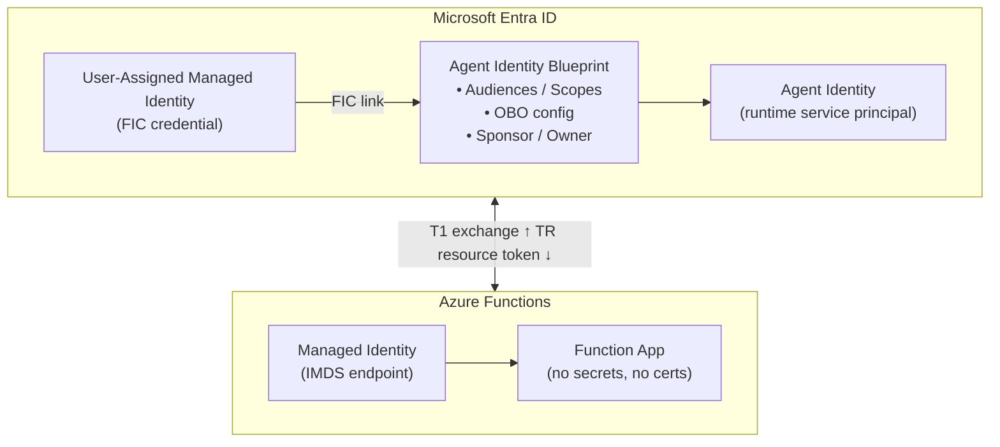

# Entra Agent ID on Azure Functions

## How a Serverless Agent Uses Agent Identity

---

## What This Covers

1. **How Functions differs from Kubernetes** — Managed Identity replaces projected SA tokens
2. **Control Plane Setup** — Blueprint + Federated Identity Credential with Managed Identity
3. **Token Exchange** — The two-step flow (MSI → Blueprint → Agent Identity)
4. **Autonomous vs Interactive Agents** — Two patterns, one platform
5. **Agent Responsibilities** — What your Function code must (and doesn't have to) do
6. **SDK Options** — Agent ID SDK companion container vs in-code Azure.Identity

---

## The Problem (Same as Kubernetes, Different Mechanics)

> How does an Azure Functions-hosted agent prove who it is to Microsoft Entra
> — and obtain an **Agent Identity token** for downstream API access?

### On Kubernetes

- Pod gets a projected service account JWT from the cluster OIDC issuer
- Entra trusts the external Kubernetes IdP via federation
- Agent exchanges the K8s JWT for an Entra Agent Identity token

### On Azure Functions

- Function App gets a **Managed Identity** token from the Azure platform (IMDS)
- Managed Identity **is already an Entra identity** — no external IdP needed
- Agent uses the MSI token as a federated credential to obtain an Agent Identity token

**Key difference:** There is no external OIDC issuer. The federation trust is between
the managed identity (already in Entra) and the Agent Identity Blueprint.

---

## Key Concepts

| Concept | What It Is |
|---|---|
| **Agent Identity Blueprint** | The template (class) in Entra — defines permissions, OBO settings, scopes |
| **Agent Identity** | A runtime instance -- the actual service principal (`servicePrincipalType: ServiceIdentity`) the agent authenticates as. RBAC roles for resource access must be assigned here, not on the blueprint |
| **User-Assigned Managed Identity** | An Entra identity assigned to the Function App — the credential source |
| **Federated Identity Credential (FIC)** | Trust link between the managed identity and the blueprint. Configured on the blueprint, not on the agent identity (agent identities have no credentials of their own). Removing the FIC instantly disables all agent identities under that blueprint (after token cache expiry -- standard 60-minute TTL). See [Blueprint concepts](https://learn.microsoft.com/entra/agent-id/identity-platform/agent-blueprint). |
| **Sponsor** | A human user or group accountable for the agent. **Mandatory** for both blueprints and agent identities -- the API returns `Request_BadRequest` without one |
| **Owner** | A human user or group who can manage the blueprint configuration |

---

## Architecture Overview



---

### The Three-Layer Mental Model

```
Blueprint             -- governance and policy    (who agents CAN be)
Agent Identity        -- auditable principal      (who the agent IS)
Hosting App (Function) -- execution environment   (WHERE the agent runs)
```

Your Function App is replaceable; the agent identity is not. The blueprint sets boundaries. The agent identity acts within them. The Function is just where code runs.

### Organizational Responsibilities

| Responsibility | Typical Owner |
|---|---|
| Create Agent Identity Blueprints | Entra / IAM team |
| Grant Graph permissions | Entra Global / Privileged Admin |
| Configure FIC (trust link to MSI) | Entra / IAM team |
| Create Agent Identities | Platform automation / dev team |
| Assign Azure RBAC / API permissions | Resource / API owners |
| Configure Function App + MSI | Application team |
| Deploy SDK + app code | Application team |
| Audit & compliance | Security / GRC |
| Emergency revocation (FIC removal) | Entra / IAM team |

---

## Step 1 — Control Plane Setup (Central / Security Team)

### 1a. Create a User-Assigned Managed Identity

This managed identity will serve as the **credential** for the blueprint.

```bash
az identity create \
  --name energy-agent-mi \
  --resource-group rg-agents \
  --location eastus
```

Record:
- **Managed Identity Client ID** — for token acquisition
- **Managed Identity Principal ID** — for the FIC subject

### 1b. Create an Agent Identity Blueprint

Using Microsoft Graph (beta):

```http
POST https://graph.microsoft.com/beta/applications/
OData-Version: 4.0
Content-Type: application/json

{
  "@odata.type": "Microsoft.Graph.AgentIdentityBlueprint",
  "displayName": "energy-ai-agent-blueprint",
  "sponsors@odata.bind": [
    "https://graph.microsoft.com/v1.0/users/<sponsor-user-id>"
  ],
  "owners@odata.bind": [
    "https://graph.microsoft.com/v1.0/users/<owner-user-id>"
  ]
}
```

Record the `appId` — this is the **Blueprint Client ID**.

> **Replication delay:** Wait ~30 seconds after blueprint creation before creating the blueprint service principal. Entra ID requires time for directory replication.

### 1c. Add the Managed Identity as a Federated Identity Credential

This is the trust link. It tells Entra: *"Accept tokens from this managed identity
as proof of identity for this blueprint."*

```http
POST https://graph.microsoft.com/beta/applications/<blueprint-app-id>/federatedIdentityCredentials
OData-Version: 4.0
Content-Type: application/json

{
  "name": "energy-agent-fic",
  "issuer": "https://login.microsoftonline.com/<tenant-id>/v2.0",
  "subject": "<managed-identity-principal-id>",
  "audiences": ["api://AzureADTokenExchange"]
}
```

> **Contrast with Kubernetes:** On K8s, the issuer is the cluster OIDC endpoint
> and the subject is `system:serviceaccount:namespace:sa-name`.
> On Functions, the issuer is Entra itself and the subject is the managed identity's principal ID.

> **Dev/test alternative:** For development and testing, you can add a password credential (client secret) to the blueprint instead of using a managed identity. This simplifies local development but must **never** be used in production:
> ```http
> POST https://graph.microsoft.com/beta/applications/<blueprint-object-id>/addPassword
> { "passwordCredential": { "displayName": "Dev Secret", "endDateTime": "2026-12-31T23:59:59Z" } }
> ```
> The blueprint then authenticates using `client_id` + `client_secret` (Basic auth) instead of MSI `client_assertion`. See [astaykov/entra-agent-id-preview-guide](https://github.com/astaykov/entra-agent-id-preview-guide) for a complete demo setup using this approach.

### 1d. Create the Blueprint Principal

```http
POST https://graph.microsoft.com/beta/serviceprincipals/graph.agentIdentityBlueprintPrincipal
OData-Version: 4.0
Content-Type: application/json

{
  "appId": "<blueprint-app-id>"
}
```

---

## Step 2 — Azure Functions Setup (App Team)

### 2a. Assign the Managed Identity to the Function App

```bash
az functionapp identity assign \
  --name my-agent-function \
  --resource-group rg-agents \
  --identities /subscriptions/<sub>/resourceGroups/rg-agents/providers/Microsoft.ManagedIdentity/userAssignedIdentities/energy-agent-mi
```

### 2b. Configure App Settings

| Setting | Value |
|---|---|
| `MyTenantId` | Your Entra tenant ID |
| `OVERRIDE_USE_MI_FIC_ASSERTION_CLIENTID` | Managed Identity Client ID |
| `WEBSITE_AUTH_CLIENT_ID` | Blueprint Client ID (appId) |
| `MyAgentId` | Agent Identity ID (after creation) |

### What you do NOT need

- No projected volume mounts
- No service account YAML
- No OIDC issuer configuration
- No client secrets or certificates

The managed identity token is obtained automatically from the Azure platform (IMDS).

---

## Step 3 — Token Exchange (The Two-Step Flow)

This is the core difference from Kubernetes. On Functions, the exchange is a
**two-step process** using the managed identity as the starting credential.

### Step 3a — Get Blueprint Exchange Token (T1)

The Function uses its managed identity token as a `client_assertion` to obtain
an exchange token scoped to the blueprint:

```http
POST https://login.microsoftonline.com/{tenant-id}/oauth2/v2.0/token
Content-Type: application/x-www-form-urlencoded

client_id=<BLUEPRINT_CLIENT_ID>
&scope=api://AzureADTokenExchange/.default
&fmi_path=<AGENT_IDENTITY_ID>
&client_assertion_type=urn:ietf:params:oauth:client-assertion-type:jwt-bearer
&client_assertion=<MANAGED_IDENTITY_TOKEN>
&grant_type=client_credentials
```

Where:
- `client_assertion` = MSI token obtained from IMDS for audience `api://AzureADTokenExchange`
- `fmi_path` = the Agent Identity ID (tells Entra which child identity to impersonate)
- Returns **T1** — the blueprint exchange token

> **Scope restriction:** `fmi_path` only works with `api://AzureADTokenExchange/.default` scope. Requesting resource scopes directly (e.g., `https://storage.azure.com/.default`) with `fmi_path` returns error `AADSTS70066`. This is why the two-step exchange is **required** -- you cannot skip directly to a resource token.

### Step 3b — Exchange T1 for Resource Token (TR)

```http
POST https://login.microsoftonline.com/{tenant-id}/oauth2/v2.0/token
Content-Type: application/x-www-form-urlencoded

client_id=<AGENT_IDENTITY_ID>
&scope=https://resource.example.com/.default
&client_assertion_type=urn:ietf:params:oauth:client-assertion-type:jwt-bearer
&client_assertion=<T1>
&grant_type=client_credentials
```

Returns **TR** — the resource access token, issued to the Agent Identity.

### What Entra validates

1. The MSI token is valid and matches the FIC on the blueprint
2. The blueprint is the parent of the specified agent identity
3. The agent identity has the requested permissions

> **Delegated tokens not supported:** Agent ID APIs reject delegated tokens (e.g., from `az account get-access-token`). Blueprint and agent identity management calls must use `client_credentials` with a dedicated management app that has `Application.ReadWrite.All` and the `Agent ID Administrator` role.

> **Token lifetime:** Resource tokens (TR) have the standard Entra ID TTL of 60 minutes. Plan your caching and refresh accordingly.

---

## Sequence Diagram

```
  Azure Platform          Function App              Entra ID
       │                      │                        │
       │── MSI token ────────▶│                        │
       │   (from IMDS)         │                        │
       │                      │                        │
       │                      │── Step 3a ────────────▶│
       │                      │   POST /token           │
       │                      │   (MSI as assertion     │
       │                      │    + fmi_path)          │
       │                      │                        │
       │                      │                        │── validates FIC
       │                      │                        │── matches blueprint
       │                      │                        │── resolves agent identity
       │                      │                        │
       │                      │◀── T1 (exchange token)─│
       │                      │                        │
       │                      │── Step 3b ────────────▶│
       │                      │   POST /token           │
       │                      │   (T1 as assertion)     │
       │                      │                        │
       │                      │◀── TR (resource token)─│
       │                      │                        │
       │                      │── Use TR to call API    │
```

---

## Step 4 — Code Implementation (C#)

### 4a. Blueprint Credential (Gets T1)

This wraps the MSI → Blueprint exchange into an `Azure.Identity` `TokenCredential`:

```csharp
internal class AgentIdentityBlueprintCredential : TokenCredential
{
    private static string TokenExchangeAudience =
        Environment.GetEnvironmentVariable("TokenExchangeAudience")
        ?? "api://AzureADTokenExchange";

    private static string ExchangeScope =
        $"{TokenExchangeAudience}/.default";

    private readonly ClientAssertionCredential _inner;

    public AgentIdentityBlueprintCredential(
        string tenantId,
        string blueprintClientId,
        string managedIdentityClientId)
    {
        var msiCred = new ManagedIdentityCredential(managedIdentityClientId);

        _inner = new ClientAssertionCredential(
            tenantId,
            blueprintClientId,
            async (ct) => (await msiCred.GetTokenAsync(
                new TokenRequestContext(new[] { ExchangeScope }), ct)).Token
        );
    }

    public override AccessToken GetToken(
        TokenRequestContext ctx, CancellationToken ct)
        => _inner.GetToken(ctx, ct);

    public override ValueTask<AccessToken> GetTokenAsync(
        TokenRequestContext ctx, CancellationToken ct)
        => _inner.GetTokenAsync(ctx, ct);
}
```

### 4b. Agent Identity Credential (Gets TR)

This wraps the Blueprint → Agent Identity exchange:

```csharp
internal class AgentIdentityCredential : TokenCredential
{
    private readonly ClientAssertionCredential _inner;

    public AgentIdentityCredential(
        string tenantId,
        string blueprintClientId,
        string managedIdentityClientId,
        string agentIdentityId)
    {
        var blueprintCred = new AgentIdentityBlueprintCredential(
            tenantId, blueprintClientId, managedIdentityClientId,
            new ClientAssertionCredentialOptions
            {
                Transport = new FmiTransport(agentIdentityId)
            });

        _inner = new ClientAssertionCredential(
            tenantId,
            agentIdentityId,
            async (ct) => (await blueprintCred.GetTokenAsync(
                new TokenRequestContext(
                    new[] { "api://AzureADTokenExchange/.default" }), ct)).Token
        );
    }

    public override AccessToken GetToken(
        TokenRequestContext ctx, CancellationToken ct)
        => _inner.GetToken(ctx, ct);

    public override ValueTask<AccessToken> GetTokenAsync(
        TokenRequestContext ctx, CancellationToken ct)
        => _inner.GetTokenAsync(ctx, ct);
}
```

### 4c. Using in a Function

```csharp
[Function("ProcessData")]
public async Task<HttpResponseData> Run(
    [HttpTrigger(AuthorizationLevel.Anonymous, "post")] HttpRequestData req)
{
    var credential = new AgentIdentityCredential(
        tenantId: Environment.GetEnvironmentVariable("MyTenantId")!,
        blueprintClientId: Environment.GetEnvironmentVariable("WEBSITE_AUTH_CLIENT_ID")!,
        managedIdentityClientId: Environment.GetEnvironmentVariable("OVERRIDE_USE_MI_FIC_ASSERTION_CLIENTID")!,
        agentIdentityId: Environment.GetEnvironmentVariable("MyAgentId")!
    );

    // Use the credential to call downstream APIs as the agent identity
    var graphClient = new GraphServiceClient(credential,
        new[] { "https://graph.microsoft.com/.default" });

    var me = await graphClient.ServicePrincipals[agentIdentityId].GetAsync();
    // ...
}
```

---

## Autonomous vs Interactive Agents

### Autonomous Agents (app-only)

- Agent acts on its own behalf using `client_credentials`
- Token is an **app-only token** scoped to the agent identity
- No user context — the agent makes independent decisions
- Use case: background processing, scheduled tasks, data pipelines

### Interactive Agents (on-behalf-of)

- Agent acts **on behalf of a signed-in user**
- Requires the blueprint to expose a scope (e.g., `access_agent`)
- Uses the OBO flow: user token → blueprint → agent identity → downstream resource
- Use case: chat interfaces, user-facing copilots, delegated actions

The interactive pattern requires a third app registration -- the **AI Application** -- which represents the front-end the user interacts with. The setup:

1. The blueprint exposes a scope (`api://<blueprint-id>/access_agent`) via `identifierUris` and `oauth2PermissionScopes`
2. The AI Application's client ID is used in the authorization code flow
3. The user authenticates and consents to `api://<blueprint-id>/access_agent offline_access`
4. The AI Application redeems the authorization code for tokens, then performs OBO exchange

```http
# User authorization (browser)
GET https://login.microsoftonline.com/{tenant}/oauth2/v2.0/authorize
  ?client_id=<AI_APP_CLIENT_ID>
  &response_type=code
  &redirect_uri=https://myapp.com/callback
  &scope=api://<BLUEPRINT_ID>/access_agent offline_access
  &response_mode=query

# Token redemption (server-side)
POST https://login.microsoftonline.com/{tenant}/oauth2/v2.0/token

client_id=<AI_APP_CLIENT_ID>
&client_secret=<AI_APP_SECRET>
&grant_type=authorization_code
&code=<AUTHORIZATION_CODE>
&redirect_uri=https://myapp.com/callback
&scope=api://<BLUEPRINT_ID>/access_agent offline_access
```

Both patterns use the same blueprint and managed identity infrastructure.
The difference is the grant type and whether a user token is involved.

---

## Digital Colleagues (Agent Users)

Beyond autonomous and interactive agents, Entra Agent ID supports a third pattern -- the **Digital Colleague**. This is a special `agentUser` object that gives the agent its own user identity -- with a mailbox, Teams presence, OneDrive, and calendar.

### Creating an Agent User

The Agent User is created as a `microsoft.graph.agentUser` User object (not a service principal), linked to an Agent Identity via `identityParentId`:

```http
POST https://graph.microsoft.com/beta/users
Content-Type: application/json
OData-Version: 4.0

{
  "@odata.type": "microsoft.graph.agentUser",
  "displayName": "Digital Worker 01",
  "userPrincipalName": "aiDigitalWorker01@tenant.onmicrosoft.com",
  "mailNickname": "aiDigitalWorker01",
  "accountEnabled": true,
  "identityParentId": "<agent-identity-id>"
}
```

> **Preview requirement:** Creating Agent Users currently requires `User.ReadWrite.All` permission on the management application. This is expected to change before GA.

### Granting Permissions to the Digital Colleague

The Agent User starts with zero permissions. Delegated permissions must be explicitly granted via admin consent:

**Option 1 -- Admin Consent URL (browser-based):**

```
https://login.microsoftonline.com/{tenant-id}/v2.0/adminconsent
  ?client_id=<agent-identity-id>
  &scope=User.Read+GroupMember.Read.All+Mail.ReadWrite+Calendars.ReadWrite
  &redirect_uri=https://entra.microsoft.com/TokenAuthorize
  &state=xyz123
```

**Option 2 -- Programmatic consent via `oauth2PermissionGrants` API:**

```http
POST https://graph.microsoft.com/beta/oauth2PermissionGrants
Authorization: Bearer <management-app-token>

{
  "clientId": "<agent-identity-id>",
  "consentType": "Principal",
  "principalId": "<agent-user-object-id>",
  "resourceId": "<ms-graph-service-principal-object-id>",
  "scope": "User.Read GroupMember.Read.All Mail.ReadWrite Calendars.ReadWrite",
  "startTime": "2025-09-24T00:00:00",
  "expiryTime": "2026-09-24T00:00:00"
}
```

### Authenticating as the Digital Colleague

The Digital Colleague uses a **three-step** authentication flow with the custom `user_fic` grant type:

**Step 1 -- Blueprint FIC token** (same as autonomous Step 3a, using MSI or client credential):

```http
POST https://login.microsoftonline.com/{tenant-id}/oauth2/v2.0/token

scope=api://AzureADTokenExchange/.default
&grant_type=client_credentials
&fmi_path=<AGENT_IDENTITY_ID>
&client_assertion_type=urn:ietf:params:oauth:client-assertion-type:jwt-bearer
&client_assertion=<MANAGED_IDENTITY_TOKEN_OR_CLIENT_SECRET>
```

**Step 2 -- Agent Identity FIC token** (using the Blueprint FIC from Step 1):

```http
POST https://login.microsoftonline.com/{tenant-id}/oauth2/v2.0/token

client_id=<AGENT_IDENTITY_ID>
&scope=api://AzureADTokenExchange/.default
&grant_type=client_credentials
&client_assertion_type=urn:ietf:params:oauth:client-assertion-type:jwt-bearer
&client_assertion=<BLUEPRINT_FIC_TOKEN>
```

**Step 3 -- Agent User token** (using both FIC tokens with `user_fic` grant type):

```http
POST https://login.microsoftonline.com/{tenant-id}/oauth2/v2.0/token

client_id=<AGENT_IDENTITY_ID>
&client_assertion_type=urn:ietf:params:oauth:client-assertion-type:jwt-bearer
&client_assertion=<BLUEPRINT_FIC_TOKEN>
&grant_type=user_fic
&requested_token_use=on_behalf_of
&scope=https://graph.microsoft.com/.default
&username=<AGENT_USER_UPN>
&user_federated_identity_credential=<AGENT_IDENTITY_FIC_TOKEN>
```

The resulting token carries the Agent User's identity. Calls to `/me` will return the Agent User, and the agent can access its own mailbox, calendar, and Teams.

### Three Agent Modes -- Comparison

| Mode | Identity Type | Token Steps | Has User Context | Use Case |
|---|---|---|---|---|
| **Autonomous** | Service principal | 2 (MSI → T1 → TR) | No | Background processing, data pipelines |
| **Interactive (OBO)** | SP acting on behalf of user | Auth code + OBO | Yes (calling user) | Chat interfaces, copilots |
| **Digital Colleague** | `agentUser` (own mailbox, Teams) | 3 (Blueprint FIC → Agent FIC → User token) | Yes (its own identity) | Send email, join meetings, collaborate |

---

## What You Own vs What the Platform Handles

### Platform handles (Azure Functions + Managed Identity)

| Concern | Handled by |
|---|---|
| Credential provisioning | Azure platform (IMDS) |
| MSI token rotation | Automatic — no manual refresh |
| Secret storage | None — no secrets exist |
| Scaling | Functions runtime |

### You must implement (or use the SDK for)

| Concern | Your responsibility |
|---|---|
| Blueprint token acquisition (T1) | `AgentIdentityBlueprintCredential` |
| Agent Identity token acquisition (TR) | `AgentIdentityCredential` |
| Token caching | Azure.Identity handles this internally |
| Agent identity creation (at startup or on-demand) | Microsoft Graph API call |
| Error handling (401, 403, 429) | Retry logic in your code |

### What you do NOT need to implement (unlike Kubernetes without sidecar)

- Token expiration tracking — `Azure.Identity` handles caching and refresh
- Manual token refresh — MSI tokens are auto-rotated by the platform
- OIDC issuer configuration — not applicable
- Projected volume mounts — not applicable

---

## SDK Options

### Option 1: Azure.Identity + Raw HTTP (in-code)

- Use `ManagedIdentityCredential` for MSI token, then raw HTTP POST with `fmi_path` for the exchange
- The `ClientAssertionCredential` class does **not** support `fmi_path` (causes AADSTS82008)
- Good for .NET/Python Functions with direct control
- Tightest integration, no additional containers

### Option 2: Microsoft Entra SDK for Agent ID (companion container)

- A containerized web service running alongside your Function
- Handles all token acquisition/validation via HTTP API endpoints
- Language-agnostic — call from Python, Node.js, Go, Java, etc.
- Endpoints: `/Validate`, `/AuthorizationHeader`, `/DownstreamApi`
- Same concept as the Kubernetes sidecar, adapted for containers

```
Function App ──HTTP──▶ Agent ID SDK Container ──▶ Entra ID
```

> The SDK companion container is the Functions equivalent of the Kubernetes sidecar.
> It absorbs all Entra coupling, so your Function code only makes HTTP calls.

---

## Kubernetes vs Functions — Side-by-Side

| Aspect | Kubernetes | Azure Functions |
|---|---|---|
| **Credential source** | Projected SA token (K8s OIDC) | Managed Identity (IMDS) |
| **Federation issuer** | K8s cluster OIDC endpoint | `login.microsoftonline.com` (Entra itself) |
| **Federation subject** | `system:serviceaccount:ns:sa` | Managed Identity principal ID |
| **External IdP trust** | Yes — K8s is external to Entra | No — MSI is native to Entra |
| **Token exchange steps** | 1 step (K8s JWT → Agent token) | 2 steps (MSI → T1 → TR) |
| **Sidecar equivalent** | Sidecar container in pod | Agent ID SDK companion container |
| **Secret management** | None (projected token) | None (IMDS) |
| **Token auto-rotation** | Kubelet rotates SA token | Azure rotates MSI token |
| **Setup complexity** | Higher (OIDC issuer, SA, volumes) | Lower (assign managed identity) |
| **Infrastructure coupling** | K8s OIDC + Entra federation | Native Azure integration |

---

## Failure Handling

| Code | Meaning | Action |
|---|---|---|
| `401` | Token expired or invalid | Retry token exchange |
| `403` | FIC misconfigured or missing permissions | Check blueprint FIC + agent identity permissions |
| `429` | Entra throttling | Exponential backoff with jitter |
| `AADSTS700024` | Client assertion validation failed | Verify managed identity is correctly linked as FIC |
| Network error | Transient IMDS or Entra failure | Retry with backoff |

---

## Key Takeaways

1. **Managed Identity replaces projected SA tokens**
   - No external IdP, no OIDC issuer config — MSI is native to Entra

2. **The federation is Entra-to-Entra**
   - The FIC links a managed identity (already in Entra) to the blueprint

3. **Two-step token exchange**
   - MSI → Blueprint exchange token (T1) → Agent Identity resource token (TR)

4. **No secrets ever touch the Function**
   - MSI tokens come from IMDS — no credentials to manage

5. **Azure.Identity simplifies the lifecycle**
   - Token caching and refresh are handled by the SDK — unlike bare K8s where you own it

6. **The Agent ID SDK companion container is the serverless sidecar**
   - Use it for polyglot scenarios or to decouple from Entra protocol details

---

## References

- **Microsoft Docs — Agent Identity on App Service / Functions**
  - [How to use an agent identity in App Service and Azure Functions](https://learn.microsoft.com/en-us/azure/app-service/overview-agent-identity)
- **Microsoft Docs — Agent OAuth Protocols**
  - [Authentication protocols in agents](https://learn.microsoft.com/en-us/entra/agent-id/identity-platform/agent-oauth-protocols)
- **Microsoft Docs — Autonomous Agent Flow**
  - [Autonomous app flow](https://learn.microsoft.com/en-us/entra/agent-id/identity-platform/agent-autonomous-app-oauth-flow)
- **Microsoft Docs — Agent Identity Concepts**
  - [Key concepts](https://learn.microsoft.com/en-us/entra/agent-id/identity-platform/key-concepts)
- **Microsoft Docs — Create a Blueprint**
  - [Create an agent identity blueprint](https://learn.microsoft.com/en-us/entra/agent-id/identity-platform/create-blueprint)
- **Microsoft Entra SDK for Agent ID**
  - [SDK overview](https://learn.microsoft.com/en-us/entra/msidweb/agent-id-sdk/overview)
- **Azure Samples**
  - [ms-identity-agent-identities](https://github.com/Azure-Samples/ms-identity-agent-identities)
- **Will Velida — Creating Blueprints with PowerShell and .NET**
  - [Blog post](https://www.willvelida.com/posts/entra-agent-id-create-agent-blueprints-and-identities/)
- **Christian Posta — Entra Agent ID on Kubernetes (for comparison)**
  - [Parts 3 & 4](https://blog.christianposta.com/entra-agent-id-agw/)
- **astaykov -- Entra Agent ID Preview Guide (REST API + PowerShell)**
  - [GitHub repo](https://github.com/astaykov/entra-agent-id-preview-guide)
- **End-to-End Flow: Agent Identity on AKS**
  - [Parallel walkthrough for Kubernetes + sidecar](flow-aks-agent-identity.md)
